# Database & Query
## 1. Konsep
### A. Pengertian Database
Database atau basis data adalah kumpulan data yang dikelola sedemikian rupa berdasarkan ketentuan tertentu yang saling berhubungan sehingga mudah dalam pengelolaannya. Melalui pengelolaan tersebut pengguna dapat memperoleh kemudahan dalam mencari informasi, menyimpan informasi dan membuang informasi.
### B. Pengertian Query
Pengertian Query adalah kemampuan untuk menampilkan data dari database untuk diolah lebih lanjut yang biasanya diambil dari tabel tabel dalam database. Pengertian query yang lain adalah pertanyaan (question) atau permintaan (order) informasi tertentu daru sebuah database yang tertulis dalam format tertentu.
### C. Contoh Produk Database
1. Oracle RDBMS<br><br><br><br>
    Oracle adalah relational database management system (RDBMS) untuk mengelola informasi secara terbuka, komprehensif dan terintegrasi. Biasa digunakan untuk pengaksesan data yang dilakukan secara online. Dirancang khusus untuk organisasi berukuran besar, bukan untuk ukuran kecil dan menengah.<br><br>
   Kelebihan dari Oracle
   - Banyak fitur yang dapat memenuhi tuntutan fleksibilitas dari organisasi besar.
   - Dapat mendayagunakan lebih dari satu server serta data storage dengan mudah dan transparan.
   
   Kekurangan dari Oracle
   - DBMS yang paling rumit dan paling mahal di dunia. Penggunaannya memakan banyak biaya, mulai dari device sampai diperlukannya DBA yang handal.
2. MySQL<br><br><br><br>
     MYSQL adalah singkatan “My Structured Query Language”. Program ini berjalan sebagai server menyediakan multi-user mengakses ke sejumlah database. multithread, multi-user, dengan sekitar 6 juta instalasi di seluruh dunia. MySQL AB gratis, dibawah lisensi GNU General Public License (GPL), tetapi ada juga MySQL yang berbayar.<br><br>
    Kelebihan MySQL
    - Free Stabil dan tangguh
    - Fleksibel dengan berbagai pemrograman
    - Security yang baik
    - Dukungan dari banyak komunitas
    - Kemudahan management database
    - Mendukung transaksi
    - Perkembangan software cukup cepat
    
    Kekurangan MySQL
    - Kurang mendukung koneksi ke bahasa pemrograman visual seperti VB, Delphi, dan Foxpro dikarenakan koneksi ini menyebabkan field yang dibaca harus sesuai dengan koneksi dari program visual tersebut.
    - Data yang ditangani belum begitu besar.
    - Lambat untuk query yang kompleks seperti LEFT JOIN yang banyak, dan penggunaan SubQuery.
    - Belum mendukung Windowing Function

3. MongoDB<br><br><br><br>
    MongoDB (dari "humongous") adalah sistem basis data berorentasi dokumen lintas platform. Diklasifikasikan sebagai basis data "NoSQL", MongoDB menghindari struktur basis data relasional tabel berbasis tradisional yang mendukung JSON seperti dokumen dengan skema dinamis (MongoDB menyebutnya sebagai format BSON), membuat integrasi data dalam beberapa jenis aplikasi lebih mudah dan lebih cepat. Dirilis di bawah Server Side Public License, MongoDB adalah perangkat lunak bebas dan sumber terbuka.<br><br>
    Kelebihan MongoDB
    - Performa yang lebih cepat<br>
        Kecepatan menjadi salah satu kelebihan dari MongoDB. Hal itu disebabkan dokumen database ini menyimpan sebagian besar datanya dalam RAM. Dengan begitu, kinerja akan lebih cepat saat sedang menjalankan kueri. Karena itu, penting untuk memiliki sistem dengan RAM dan indeks yang akurat untuk meningkatkan kinerja.
    - Sederhana<br>
        Tak hanya memiliki performa yang lebih cepat, MongoDB juga unggul karena kesederhanaan yang ditawarkannya. MongoDB menggunakan sintaks kueri yang simple sehingga lebih mudah dipahami daripada SQL. Selain itu, mulai dari proses penginstalan hingga eksekusi jauh lebih mudah dan cepat. Karena itu, MongoDB lebih disukai pemula karena kemudahan yang dimilikinya.
    - Fleksibilitas<br>
        Menurut KnowledgeNile, skema MongoDB tidak ditentukan. Artinya, program database tersebut memiliki arsitektur skema yang dinamis untuk penyimpanan data yang tidak terstruktur. Fleksibilitas dari MongoDB sangat diperlukan apalagi saat ini dunia data berkembang sangat cepat. Dengan menggunakan program database yang fleksibel tentunya sangat bermanfaat karena lebih mudah beradaptasi dengan perubahan.
    - Skalabilitas<br>
        Skalabilitas disebut menjadi salah satu kelebihan utama yang dimiliki oleh MongoDB. Pasalnya, MongoDB menggunakan skalabilitas horizontal yang membuatnya lebih mudah untuk meningkatkan kapasitas penyimpanan. Berbeda dengan database SQL yang menggunakan skalabilitas vertikal yang memerlukan penyimpanan lebih besar. Saat kebutuhan data meningkat, pengguna MongoDB dapat menambah cloud untuk meningkatkan kapasitas penyimpanan. Sebaliknya, untuk database SQL diperlukan hardware baru dengan spesifikasi yang lebih tinggi untuk meningkatkan kapasitas penyimpanan.
    
    Kekurangan MongoDB
    - Tidak mendukung transaksi<br>
        Transaksi mengacu pada proses meninjau dan menghilangkan data yang tidak diinginkan. MongoDB menggunakan transaksi ACIS (Atomicity, Consistency, Isolation, and Durability) yang tidak memerlukan transaksi. Namun, jika kamu membutuhkan transaksi untuk memperbarui dokumen, MongoDB tidak dapat diandalkan karena berpotensi terdapat kerusakan data.
    - Menggunakan banyak memori<br>
        Salah satu kekurangan terbesar dari MongoDB menurut GeeksforGeeks adalah penggunaan memori yang tinggi. Memang program database yang satu ini membutuhkan penyimpanan dengan jumlah yang besar karena kurangnya fungsionalitas yang menyebabkan duplikasi data. Data yang terduplikasi tersebut akan memakan banyak ruang di memori sehingga cepat penuh.
    - Ukuran data yang terbatas<br>
        Kekurangan selanjutnya dari MongoDB yang satu ini sering membuat penggunanya kerepotan. Pasalnya, ukuran data yang bisa digunakan hanya dibatasi sebesar 16 MB dalam setiap dokumennya. Selain itu, performa nesting untuk dokumen juga dibatasi hanya 100 per levelnya.
    - Masalah dalam pengindeksan<br>
        MongoDB memang menawarkan kinerja dengan kecepatan yang tinggi. Namun, hal itu bisa terjadi jika indeks yang dilakukan tepat. Melansir dari Virtual-DBA, saat indeks yang diimplementasikan kurang tepat, maka performa MongoDB akan berjalan lambat. Memperbaiki kesalahan dalam indeks juga memakan waktu, sehingga masalah dalam pengindeksan ini juga menjadi kekurangan dari MongoDB.
    
    MongoDB vs SQL<br><br><br><br>
        
4. Postgre SQL<br><br><br><br>
    PostgreSQL adalah sebuah sistem basis data yang disebarluaskan secara bebas menurut Perjanjian lisensi BSD. Peranti lunak ini merupakan salah satu basis data yang paling banyak digunakan saat ini, selain MySQL dan Oracle. PostgreSQL menyediakan fitur yang berguna untuk replikasi basis data. Fitur-fitur yang disediakan PostgreSQL antara lain DB Mirror, PGPool, Slony, PGCluster, dan lain-lain.<br><br>
     Kelebihan Postgre SQL
     - Dengan menggunakan PostgreSQL, tidak ada seorangpun dapat menuntut untuk pelanggaran terhadap perjanjian lisensi, sebagaimana tidak ada biaya lisensi yang diasosiasikan (digabungkan) untuk software. Hal ini menyebabkan PostgreSQL memberikan keuntungan tambahan, antara lain: bisnis menjadi lebih profitable dengan skala penyebaran yang luas. tidak ada kemungkinan diperiksa untuk pemenuhan lisensi, fleksibel untuk menjalankan konsep penelitian dan trial deployment tanpa memerlukan biaya lisensi tambahan.
     - Menghemat biaya staffing karena telah didesain dan dibuat sedemikian rupa untuk mempunyai tingkat pemeliharaan dan kebutuhan yang lebih rendah.
     - Terpercaya dan stabil. (banyak perusahaan yang melaporkan bahwa PostgreSQL tidak pernah, bahkan sekalipun, mengalami crashed pada saat melakukan operasi dengan tingkat aktivitas yang tinggi)
     - Extensible, artinya tidak memerlukan biaya untuk perluasan. Menggunakan penyimpanan data dengan banyak baris (multiple rows) yang dinamakan MVCC. Hal ini dimaksudkan agar PostgreSQL sangat responsif pada high volume environments.
     - Kaya akan fitur.
     
     Kekurangan Postgre SQL
     - Kurang cocok bekerja di lingkungan web jika dibandingkan dengan MySQL.
     - Kurang fokus dalam hal kelangsingan dan kecepatan.
     - Arsitektur dengan multiprose sulit diterapkan ke Windows, sebab Windows sangat thread-oriented. Saat ini bisa dijalankan di Windows, tapi melalui lapisan emulasi Cygwin.
     - Kurang unggul dalam hal ketersediaan fungsi built-in.
     - Replikasi di PostgreSQL belum disertakan dalam distribusi standarnya yang terbatas hanya bisa melakukan penambahan kolom, penggantian nama kolom, dan penggantian nama tabel.

5. SQLite<br><br><br><br>
    SQLite merupakan sebuah sistem manajemen basisdata relasional yang bersifat ACID-compliant dan memiliki ukuran pustaka kode yang relatif kecil, ditulis dalam bahasa C. SQLite merupakan proyek yang bersifat public domain yang dikerjakan oleh D. Richard Hipp.<br><br>
     Kelebihan SQLite
     - Berbasis file<br>
        Seluruh database terdiri dari satu file pada disk, yang membuatnya sangat portabel.
     - Terstandarisasi dengan baik<br>
        Meskipun mungkin tampak seperti sebuah  implementasi DB yang "sederhana", SQLite menggunakan SQL yang tentunya kita sudah tahu bahwa SQL itu sudah sangat terstandar dengan baik.
     - Sangat baik untuk pengambangan dan bahkan pengujian<br>
        SQLite, dengan basis fitur yang kaya, dapat menawarkan lebih dari apa yang dibutuhkan untuk pembangunan dengan kesederhanaan bekerja dengan satu file dan terkait pustaka bahasa C.

     Kekurangan SQLite
     - Tidak ada manajemen pengguna<br>
        Database canggih datang dengan dukungan untuk pengguna, dikelola yaitu dengan koneksi hak akses set ke database dan tabel. Mengingat tujuan dan sifat SQLite (tidak digunakan untuk pengguna multi/banyak), fitur ini tidak ada.
     - Kurangnya kemungkinan untuk bekerja dengan kinerja tambahan<br>
        Sesuai dengan namanya SQLite mengutamakan kesederhanaan dan portabilitas, jadi SQLite tidak mungkin untuk bekerja dengan untuk mendapatkan banyak tambahan kinerja. Karena SQLite kesederhanaan, secara teknis tidak mungkin untuk membuatnya berkinerja lebih.

Dan masih banyak lagi jenis-jenis produk database, khusus di mata kuliah ini kita akan menggunakan Database MySQL

## 2. Install XAMPP
Sebenarnya untuk MySQL dan Apache kita dapat menginstallnya secara independen (terpisah), namun pada awal perkuliahan ini, untuk memudahkan dalam memahami materi, kita gunakan XAMPP terlebih dahulu, karena di dalamnya sudah termasuk beberapa sub-aplikasi yang kita perlukan, seperti Apache dan MySQL, dan berikut cara instalasinya : <br>
1. Download XAMPP terbaru<br>
    Silakan Download XAMPP terbaru untuk Windows di sini ([Download](https://downloadsapachefriends.global.ssl.fastly.net/8.1.1/xampp-windows-x64-8.1.1-2-VS16-installer.exe))
2. Buka file XAMPP yang baru saja diunduh<br>
    Kadang pada proses ini muncul pesan error. Jika ada, abaikan saja dan lanjutkan dengan klik YES dan OK.<br><br>
3. Klik Next pada jendela installer<br>
    Pada tahapan ini seringkali muncul jendela yang isinya meminta Anda menutup semua aplikasi yang sedang berjalan. Jika semua aplikasi sudah ditutup, maka klik tombol Next.<br>
4. Pilih sub-aplikasi yang ingin di install<br>
    Pada tahapan ini, Anda akan diminta untuk memilih sub-aplikasi yang mau diinstal. Centang saja semua pilihan dan klik tombol Next.<br>
5. Pilih folder instalasi<br>
    Pastikan kapasitas hardisk atau drive tempat Xampp mau di install masih tersedia kuota yang mencukupi.<br>
6. Pilih bahasa<br>
    Gunakan bahasa yang Anda familiar dengannya, kemudian klik Next.<br>
7. Jalankan instalasi<br>
    Klik Next jika Anda sudah siap memulai proses instalasi Xampp.<br>
8. Tunggu proses instalasi selesai<br>
    Proses Instalasi mungkin memakan waktu beberapa menit.<br>
9. Start XAMPP<br>
    Jika sudah muncul jendela seperti di bawah ini, klik tombol Finish untuk menyelesaikannya. Selain itu, akan muncul opsi apakah Anda mau langsung menjalankan aplikasi XAMPP atau tidak. Jika ya, maka centang opsi tersebut.<br>
10. Cara Menjalankan Aplikasi XAMPP<br>
    Bukalah aplikasi XAMPP, bisa melalui Start Menu atau Desktop, dan klik icon XAMPP.<br><br>
    Atau, jika Anda ingin membukanya langsung begitu proses instalasi selesai, maka centang kotak “Do you want to start the Control Panel now?” seperti terlihat pada gambar no. #9 di atas.<br><br>
    Setelah terbuka, silahkan klik tombol Start pada kolom Action sehingga tombol tersebut berubah menjadi Stop. Dengan mengklik tombol tersebut, artinya itulah aplikasi yang dijalankan. Biasanya jika saya menggunakan XAMPP, yang saya start hanyalah aplikasi Apache dan MySQL, karena saya tidak memerlukan aplikasi seperti Filezilla, dan lain-lain.<br><br><br>
    Sekarang bukalah browser kesukaan Anda, dan coba ketikkan http://localhost/ di address bar. Jika muncul tampilan seperti gambar di bawah ini, instalasi telah berhasil.<br>
11. Jika Anda mengalami kesulitan di dalam menjalankan XAMPP seperti Apache XAMPP tidak bisa berjalan, mungkin bisa membaca artikel ini: [Mengatasi Error pada XAMPP](https://webhostmu.com/apache-tidak-bisa-running-di-xampp/)

## 3. Query Sederhana
Selanjutnya cobalah untuk masuk ke halaman ```localhost/phpmyadmin``` Jika diminta username dan password maka masukkan username root dan password dapat dikosongkan (default)<br><br><br><br>
Pada halaman inilah, Anda dapat melakukan pengelolaan database untuk website Anda. Misalnya, membuat database, mengedit, menghapus, bahkan melakukan query data.
### A. Membuat Database
1. Pada bagian kiri localhost/phpMyAdmin, silahkan klik New untuk membuat database baru.<br><br><br><br>
2. Masukkan nama database pada kolom yang tersedia. Pada tutorial ini, kami menggunakan database_baru sebagai nama database yang akan dibuat. Jika sudah diberi nama, klik Create.<br><br><br><br>
3. Nantinya, database baru yang Anda buat akan tampil di bagian kiri halaman phpMyAdmin. Sekarang, Anda sudah bisa menambahkan tabel sebagai tempat penyimpanan data pada database baru.
### B. Membuat Tabel
1. Kali ini, mari membuat tabel dengan empat kolom untuk data pengguna dengan nama tabel users.  Kemudian, klik tombol Go.<br><br><br><br>
2. Di bagian ini, Anda harus memasukkan nama kolom dan tipe datanya. Untuk tabel users, kami membuat kolom id, name, email, dan address. Jika sudah terisi seperti gambar di bawah ini, klik tombol Save.<br><br><br><br>
3. Sekarang, Anda sudah memiliki database dengan tabel users yang siap dipakai.<br><br><br><br>
4. Selanjutnya kita akan memasukkan data ke dalam tabel users, silakan klik kolom insert pada header phpmyadmin <br><br><br><br>
5. Isikan dengan data sebagai berikut<br><br>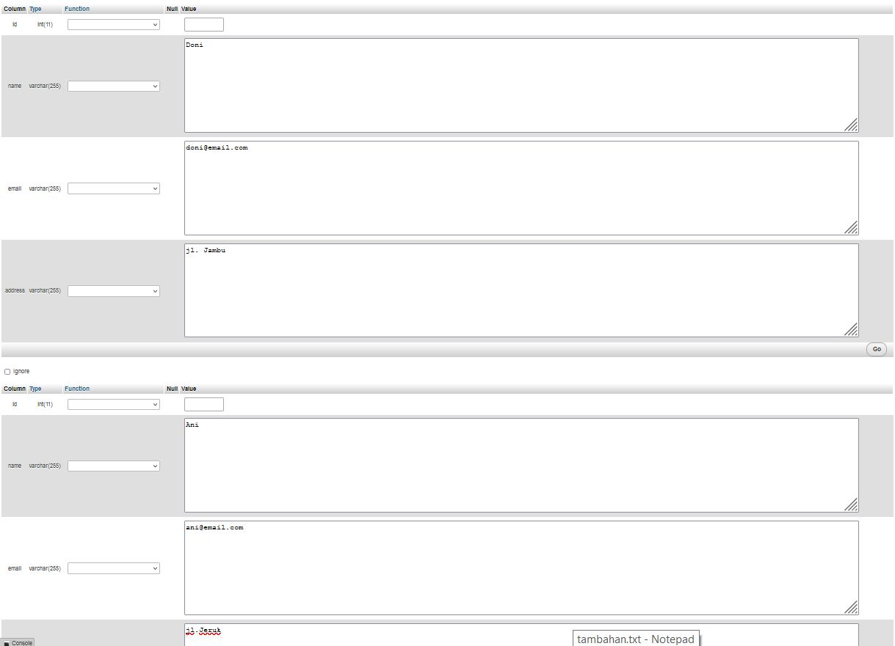<br><br>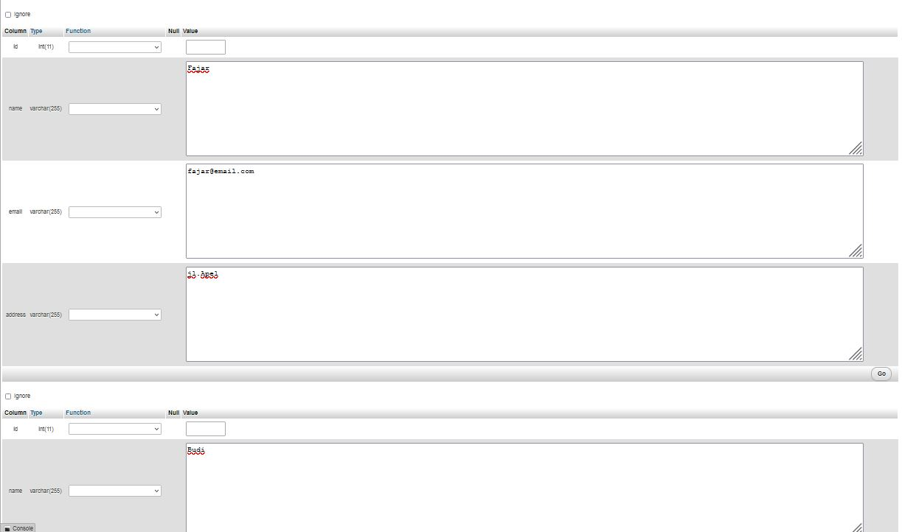<br><br>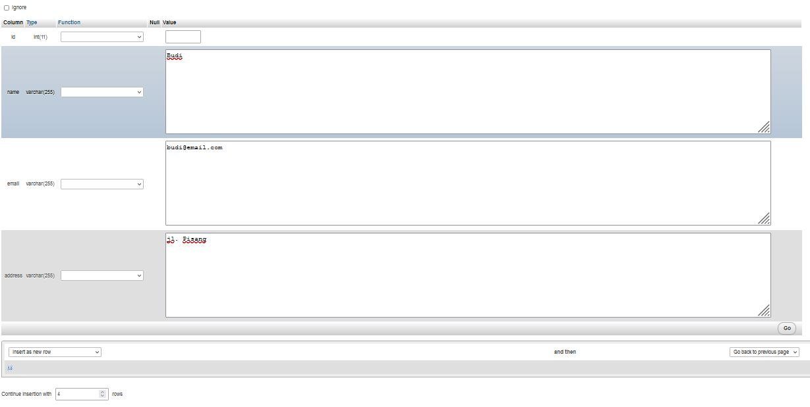<br><br>
6. Apabila pada komputer kalian tidak bisa memasukkan data lebih dari 2, silakan scroll ke bawah dan tambahkan jumlah data<br><br>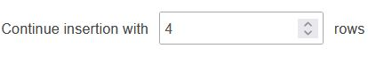<br><br>dan jangan lupa untuk tidak mencentang bagian ignore di bagian atas tiap kolom input data<br><br><br><br>
7. Terakhir tekan tombol go<br><br>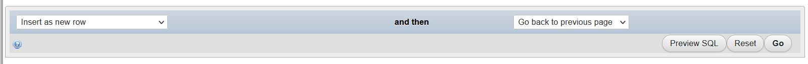<br><br>
8. Maka data sudah masuk ke dalam tabel<br><br>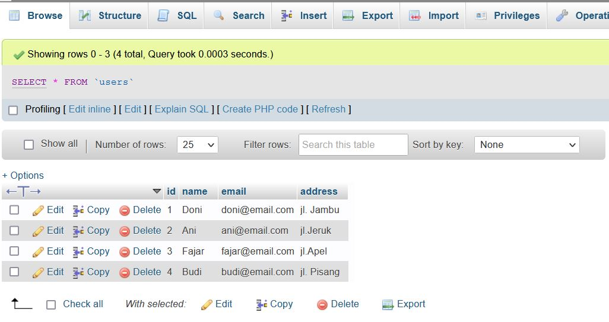<br><br>
9. Selanjutnya, kita akan membuat tabel bernama penjualan dengan cara seperti di atas, dan kolom sebagai berikut<br><br>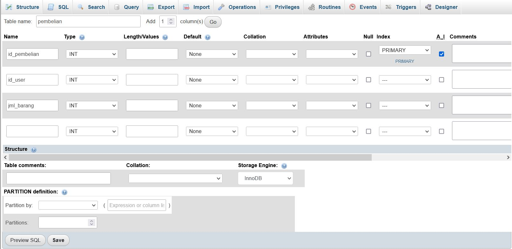<br><br>
10. Dan masukkan data sebagai berikut dengan cara melalui halaman insert phpmyadmin<br><br>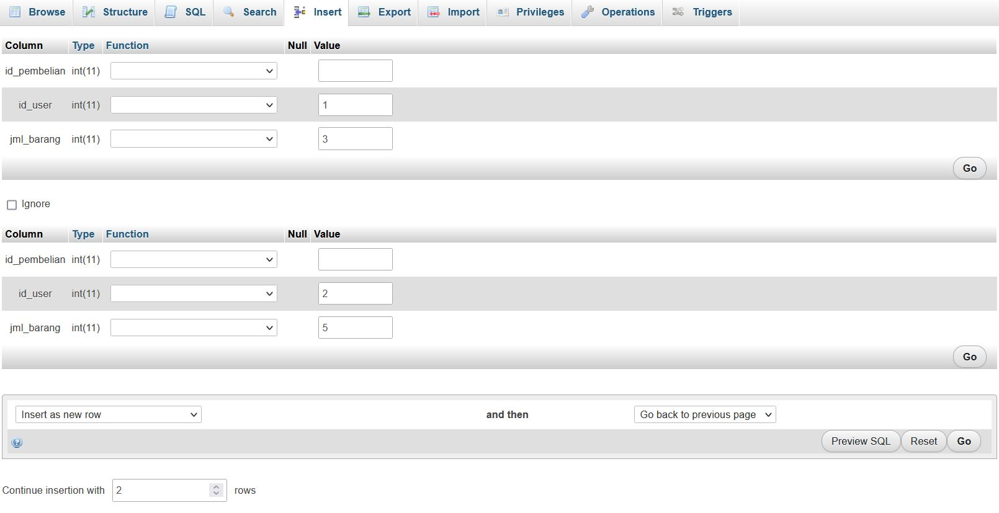<br><br>
### C. Query Sederhana
Selanjutnya dengan kedua tabel tersebut kita akan mencoba mencari hubungan antara nama user, alamat user, dan jumlah barang yang dibeli.
1. Kita dapat menggunakan query sebagai berikut <br><br>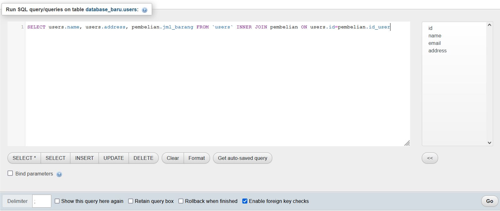<br><br>Penjelasan :<br>a. ```SELECT``` : merupakan perintah dalam mysql untuk menampilkan data<br>b. ```users.name``` : digunakan untuk mengambil nilai pada kolom nama dari tabel users<br>c. ```pembelian.jml_barang``` : digunakan untuk mengambil data dari kolom jml_barang pada tabel pembelian<br>d. ```FROM 'users'``` : mengambil data dari tabel users<br>e. ```INNER JOIN pembelian``` : Menggabungkan dengan tabel pembelian<br>f. ```ON users.id=pembelian.id_user``` : tabel users dan pembelian akan digabungkan dengan memperhatikan nilai yang sama dari kolom id pada tabel users dan kolom id_user dari tabel pembelian
2. Maka kita akan mendapatkan hasil query sebagai berikut<br><br>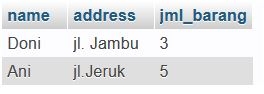<br><br>

## 4. Generate Big Data
Selanjutnya kita akan mencoba untuk menggunakan data yang lebih besar, tentu saja kita tidak akan memasukkan data satu per satu, melainkan kita akan membuatnya menggunakan program, dan berikut programnya :<br><br>
**config.py**
```python
panjang_nrp = 14
total_siswa = 20
total_soal = 30
pilihan_jawaban = ["A", "B", "C", "D"]

# Jumlah 38 kota
kota = [
    "Kabupaten Bangkalan",
    "Kabupaten Banyuwangi",
    "Kabupaten Blitar",
    "Kabupaten Bojonegoro",
    "Kabupaten Bondowoso",
    "Kabupaten Gresik",
    "Kabupaten Jember",
    "Kabupaten Jombang",
    "Kabupaten Kediri",
    "Kabupaten Lamongan",
    "Kabupaten Lumajang",
    "Kabupaten Madiun",
    "Kabupaten Magetan",
    "Kabupaten Malang",
    "Kabupaten Mojokerto",
    "Kabupaten Nganjuk",
    "Kabupaten Ngawi",
    "Kabupaten Pacitan",
    "Kabupaten Pamekasan",
    "Kabupaten Pasuruan",
    "Kabupaten Ponorogo",
    "Kabupaten Probolinggo",
    "Kabupaten Sampang",
    "Kabupaten Sidoarjo",
    "Kabupaten Situbondo",
    "Kabupaten Sumenep",
    "Kabupaten Trenggalek",
    "Kabupaten Tuban",
    "Kabupaten Tulungagung",
    "Kota Batu",
    "Kota Blitar",
    "Kota Kediri",
    "Kota Madiun",
    "Kota Malang",
    "Kota Mojokerto",
    "Kota Pasuruan",
    "Kota Probolinggo",
    "Kota Surabaya",
]

mata_pelajaran = [
    "Fisika",
    "Kimia",
    "Matematika",
    "Biologi",
    "Agama",
    "Bahasa Indonesia",
    "Bahasa Inggris",
]
```
File ini sebenarnya hanya berisi deklarasi dari variabel yang akan dipakai, baik itu panjang nrp, total siswa, total soal, huruf yang menjadi pilihan jawaban, nama-nama kota, dan nama-nama mata pelajaran.
<br><br>
**generate-jawaban.py**
```python
from faker import Faker
import csv
import config
import json

fake = Faker()

total_siswa = config.total_siswa*38
total_soal = config.total_soal
id = 0

f = open("csv/jawaban.csv", "w")
writer = csv.writer(f, doublequote=True, quoting=csv.QUOTE_ALL, lineterminator="\n")
header = ["id", "id_siswa", "id_soal", "id_mapel", "jawaban"]
writer.writerow(header)

for idx_siswa in range(total_siswa):
    id_siswa = idx_siswa + 1
    for idx_mapel in range(len(config.mata_pelajaran)) :
        id_mapel = idx_mapel+1
        for idx_soal in range(total_soal):
            id += 1
            id_soal = idx_soal + 1
            jawaban = fake.random_element(elements=config.pilihan_jawaban)
            writer.writerow([id, id_siswa, id_soal, id_mapel, jawaban])

f.close()
```
Penjelasan :
1. ```from faker import Faker``` : mengimport modul Faker dari library faker yang berfungsi untuk membuat dataset, seperti melakukan random nama, umur, lokasi, dan lain sebagainya
2. ```import csv``` : melakukan import library csv yang berfungsi untuk mencetak data yang di generate ke dalam CSV
3. ```import config``` : mengimport file config.py
4. ```import json``` : mengimport library json yang memungkinkan kita untuk mengolah data dengan format json
5. ```fake = Faker()``` : mendeklarasikan variabel fake yang berisi fungsi Faker()
6. ```total_siswa = config.total_siswa*38``` : mendeklarasikan variabel total_siswa yang nilainya sama dengan total_siswa yang sudah dideklarasikan pada file config.py dikali dengan 38 (sesuai jumlah kota)
7. ```total_soal = config.total_soal``` : mendeklarasikan variabel total_soal yang nilainya sama dengan total_soal yang sudah dideklarasikan pada file config.py
8. ```id = 0``` : mendeklarasikan variabel id yang nantinya digunakan untuk mengisi kolom id sebagai primary key
9. ```f = open("csv/jawaban.csv", "w")``` : membuka/membuat(jika belum ada) file jawaban.csv yang berada di dalam folder csv dengan metode write("w")
10. ```writer = csv.writer(f, doublequote=True, quoting=csv.QUOTE_ALL, lineterminator="\n")``` : mendeklarasikan variabel writer dengan isi fungsi writer dari library csv di mana nantinya fungsi ini akan menuliskan outputnya pada file csv/jawaban.csv, ```doublequote=True``` berfungsi untuk melakukan escape jika dalam isi string juga terdapat tanda petik, ```quoting=csv.QUOTE_ALL``` berfungsi untuk memberikan tanda petik pada tiap kolom, dan ```lineterminator="\n"``` berfungsi untuk mengakhiri line dengan karakter ```\n```
11. ```header = ["id", "id_siswa", "id_soal", "jawaban"]``` : variabel header yang memuat nama-nama kolom
12. ```writer.writerow(header)``` : menuliskan header pada file csv
13. ```for idx_siswa in range(total_siswa):``` : fungsi loop untuk menjalankan program sebanyak total_siswa yang sudah dideklarasikan
14. ```id += 1``` : melakukan increment variabel id
15. ```id_siswa = idx_siswa + 1``` : id siswa yang akan dimasukkan ke dalam database sama degan nilai dari idx_siswa saat ini ditambah 1
16. ```for idx_mapel in range(len(config.mata_pelajaran)) :``` : melakukan looping sebanyak panjang dari list mata_pelajaran yang sudah didefinisikan pada config
17. ```id_mapel = idx_mapel+1``` : nilai id_mapel adalah idx_mapel ditambah 1
18. ```for idx_soal in range(total_soal):``` : melakukan loop sebanyak total_soal yang telah ditentukan sebelumnya (pada file config.py)
19. ```id_soal = idx_soal + 1``` : id_soal yang akan dimasukkan ke dalam database adalah nilai idx_soal sekarang ditambah 1
20. ```jawaban = fake.random_element(elements=config.pilihan_jawaban)``` : melakukan random data jawaban dengan elemen berupa pilihan_jawaban yang telah di deklarasikan pada file config.py
21. ```writer.writerow([id, id_siswa, id_soal, id_mapel, jawaban])``` : mencetak id, id_siswa, id_soal, id_mapel, dan jawaban ke dalam file csv
22. ```f.close()``` : menutup interaksi soal dengan file csv

<br><br>
**generate-kota.py**
```python
import csv
import config

# buka file yang akan ditulis dengan mode write (akan melakukan overwrite)
f = open('csv/kota.csv', 'w')

# inisiasi `writer` dari csv untuk dapat menulis kedalam file csv
writer = csv.writer(f, doublequote=True, quoting=csv.QUOTE_ALL, lineterminator="\n")

# header yang akan ditulis (berupa list)
header = ['id', 'nama']

# tulis header ke file csv
writer.writerow(header)

id = 0

# looping untuk menulis data ke file csv
for _kota in config.kota:
    id += 1

    # tulis baris ke file csv
    writer.writerow([id,_kota])

# tutup file agar tidak terjadi error
f.close()
```
Penjelasan (untuk line yang sama dengan file sebelumnya tidak dijelaskan ulang) :
1. ```header = ['id', 'nama']``` : header dari csv yang akan dihasilkan dari program ini adalah id dan nama
2. ```for _kota in config.kota:``` : melakukan looping sebanyak kota yang sudah di deklarasikan pada file config.py

<br><br>
**generate-mata-pelajaran.py**
```python
import csv
import config

f = open('csv/mata_pelajaran.csv', 'w')
writer = csv.writer(f, doublequote=True, quoting=csv.QUOTE_ALL, lineterminator="\n")

header = ['id', 'nama']
writer.writerow(header)

id = 0
for _mapel in config.mata_pelajaran:
    id = id + 1
    writer.writerow([id,_mapel])

f.close()
```
Penjelasan (untuk line yang sama dengan file sebelumnya tidak dijelaskan ulang) :
1. ```for _mapel in config.mata_pelajaran:``` : melakukan looping sebanyak mata_pelajaran yang sudah dideklarasikan pada config.py

<br><br>
**generate-siswa.py**
```python
from faker import Faker
import csv
import config

# inisiasi objek Faker
fake = Faker()

# Format nrp (14 digit): <3-digit-id-kota><x-digit-padding><urutan-siswa-di-kota>
# contoh: 02100000000123
# 021 - id kota
# 000123 - urutan siswa di kota

# Jumlah 38 kota
# 001 - 038

total_kota = len(config.kota)
total_siswa = config.total_siswa
id = 0

f = open("csv/siswa.csv", "w")
writer = csv.writer(f, doublequote=True, quoting=csv.QUOTE_ALL, lineterminator="\n")
header = ["id", "id_kota", "nrp", "nama"]

writer.writerow(header)

for idx_kota in range(total_kota):
    id_kota = idx_kota + 1

    # zfill = menambahkan 0 di depan sampai panjang n (padding)
    prefix_kota = str(id_kota).zfill(3)
    for idx_siswa in range(total_siswa):
        id += 1
        nrp = prefix_kota + str(idx_siswa + 1).zfill(config.panjang_nrp - 3)
        nama = fake.name()
        row = [id, id_kota, nrp, nama]
        writer.writerow(row)
```
Penjelasan (untuk line yang sama dengan file sebelumnya tidak dijelaskan ulang) :
1. ```total_kota = len(config.kota)``` : mendefinisikan variabel total_kota yang menampung nilai panjang kota yang didefinisikan pada file config.py
2. ```prefix_kota = str(id_kota).zfill(3)``` : membuat prefix kota dengan cara mengambil id_kota saat ini dan menambahkan padding hingga nantinya total ada 3 digit (misal : id_kota sekarang adalah 1 maka dengan zfill(3) akan menjadi 001)
3. ```nrp = prefix_kota + str(idx_siswa + 1).zfill(config.panjang_nrp - 3)``` : membuat nrp dengan cara menggabungkan prefiks kota dan idx_siswa saat ini yang sudah diberi padding sesuai panjang_nrp-3 yang telah dideklarasikan pada config.py (misal : prefix_kota adalah 001 sedangkan idx_siswa saat ini adalah 20 maka akan diberi padding sebanyak 9 sehingga menjadi 00000000020 dan jika digabungkan dengan prefix_kota akan menjadi 00100000000020)
4. ```nama = fake.name()``` : mendapatkan nama dengan menggunakan fungsi name() pada modul Faker (random)
5. ```row = [id, id_kota, nrp, nama]``` : kolom yang akan dipakai dalam tabel ini adalah id, id_kota, nrp, dan nama

<br><br>
**generate-soal.py**
```python
from faker import Faker
import csv
import config
import json

# inisiasi object Faker
fake = Faker()

# ambil total soal dari config
total_soal = config.total_soal
id = 0

f = open("csv/soal.csv", "w")
writer = csv.writer(f, doublequote=True, quoting=csv.QUOTE_ALL, lineterminator="\n")
header = ["id", "id_mapel", "body", "pilihan_jawaban", "jawaban_benar"]
writer.writerow(header)

total_mapel = len(config.mata_pelajaran)
for idx_mapel in range(total_mapel):
    id_mapel = idx_mapel + 1
    for i in range(total_soal):
        id += 1

        # gunakan faker untuk membuat susunan string random maksimal 200 karakter
        body = fake.paragraph(nb_sentences=2)

        pilihan_jawaban = dict()
        for pilihan in config.pilihan_jawaban:
            pilihan_jawaban[pilihan] = fake.paragraph(nb_sentences=1)

        # pilih satu jawaban random berdasarkan list dari config
        jawaban_benar = fake.random_element(elements=config.pilihan_jawaban)

        writer.writerow([id, id_mapel, body, pilihan_jawaban, jawaban_benar])

f.close()
```
Penjelasan (untuk line yang sama dengan file sebelumnya tidak dijelaskan ulang) :
1. ```header = ["id", "id_mapel", "body", "pilihan_jawaban", "jawaban_benar"]``` : header yang akan dihasilkan oleh program ini adalah id, id_mapel, body, pilihan_jawaban, jawaban_benar
3. ```body = fake.paragraph(nb_sentences=2)``` : menggunakan faker untuk melakukan generate isi soal dengan maksimal panjang string adalah 200 karakter
4. ```pilihan_jawaban = dict()``` : membuat dictionary, dalam python dictionary adalah sebuah object yang berbentu seperti berikut ```dict(name = "John", age = 36, country = "Norway")```
5. ```pilihan_jawaban[pilihan] = fake.paragraph(nb_sentences=1)``` : merandom isi dari pilihan jawaban dengan maksimal 100 karakter
6. ```jawaban_benar = fake.random_element(elements=config.pilihan_jawaban)``` : merandom jawaban benar, berdasarkan pilihan_jawaban yang telah di deklarasi pada file config.py

<br><br>
**generate-schema.py**
```python
"""
Opsi lain untuk bikin schema sql
"""

from sqlalchemy import *

db_username = 'm42nk'
db_host = 'localhost'
db_name = 'CBT_JATIM'

engine = create_engine(f'mysql://{db_username}@{db_host}/{db_name}')
metadata_obj = MetaData(engine)

metadata_obj.drop_all()

Table('Kota', metadata_obj,
    Column('id', Integer, primary_key=True),
    Column('nama', String(255)),
)

Table('Mata_Pelajaran', metadata_obj,
    Column('id', Integer, primary_key=True),
    Column('nama', String(255)),
)

Table('Siswa', metadata_obj,
    Column('id', Integer, primary_key=True),
    Column('id_kota', Integer, ForeignKey("Kota.id"), nullable=false),
    Column('nrp', String(255)),
    Column('nama', String(255)),
)

Table('Soal', metadata_obj,
    Column('id', Integer, primary_key=True),
    Column('id_mapel', Integer, ForeignKey("Mata_Pelajaran.id"), nullable=false),
    Column('body', String(255)),
    Column('pilihan_jawaban', String(255)),
    Column('jawaban_benar', String(1)),
)

Table('Jawaban', metadata_obj,
    Column('id', Integer, primary_key=True),
    Column('id_siswa', Integer, ForeignKey("Siswa.id"), nullable=false),
    Column('id_soal', Integer, ForeignKey("Soal.id"), nullable=false),
    Column('id_mapel', Integer, ForeignKey("Mata_Pelajaran.id"), nullable=false),
    Column('jawaban', String(1)),
)

"""
Table('Result', metadata_obj,
    Column('id', Integer, primary_key=True),
    Column('id_siswa', Integer, ForeignKey("Siswa.id"), nullable=false),
    Column('id_soal', Integer, ForeignKey("Soal.id"), nullable=false),
    Column('id_mapel', Integer, ForeignKey("Mata_Pelajaran.id"), nullable=false),
    Column('is_jawaban_benar', Boolean),
)
"""

metadata_obj.create_all()
```
Program ini bertujuan untuk membuat tabel pada database dengan penjelasan sebagai berikut :
1. ```from sqlalchemy import *``` : mengimport library sqlalchemy, yang berfungsi untuk menghubungkan python dengan database
2. ```db_username = '<<username>>'``` : mendeklarasikan variabel db_username untuk menyimpan username yang digunakan untuk login ke database
3. ```db_host = '<<alamat database>>'``` : mendeklarasikan variabel db_host untuk menyimpan alamat database (bisa localhost/IP)
4. ```db_name = '<<nama_database>>'``` : mendeklarasikan variabel db_name untuk menyimpan nama database di mana kita akan membuat schema
5. ```engine = create_engine(f'mysql://{db_username}@{db_host}/{db_name}')``` : mendefinisikan jenis database yang akan dipakai, yaitu mysql, dan memasukkan username database, alamat database, dan password database
6. ```metadata_obj = MetaData(engine)``` : membuat object untuk menyimpan metadata dari database
7. ```metadata_obj.drop_all()``` : drop semua table yang ada di metadata yang dipakai
8. ```Table('Kota', metadata_obj,``` : membuat tabel bernama 'Kota'
9. ```Column('id', Integer, primary_key=True),``` : membuat kolom id dengan tipe integer dan dijadikan sebagai primary key
10. ```Column('nama', String(255)),```  : membuat kolom nama dengan tipe string dan panjang string adalah 255
11. ```Column('id_kota', Integer, ForeignKey("Kota.id"), nullable=false),``` : membuat kolom id_kota dengan tipe integer, dengan foreign key pada kolom id di tabel Kota, dan nilainya tidak dapat null
12. Untuk baris lainnya kurang lebih sama dengan penjelasan nomor 8-12

<br><br>
**generate-all.py**
```python
import importlib

# filenames
files = [
    'generate-kota',
    'generate-siswa',
    'generate-mata-pelajaran',
    'generate-soal',
    'generate-jawaban',
]

# execute each file (pake importlib)
for file in files:
    importlib.import_module(file)
```
Tujuan dari program ini adalah menjalankan semua file yang lain (kecuali generate-schema.py), dan berikut penjelasannya :
1. ```import importlib``` : mengimport library importlib untuk menjalankan tiap file yang akan dipanggil
2. ```files = [``` : membuat list yang berisi nama file yang akan dieksekusi
3. ```for file in files:``` : melakukan looping sebanyak isi list files
4. ```importlib.import_module(file)``` : menjalankan file yang dipanggil

<br><br>
**Cara Menjalankan**
1. Download file dari repository yang ada, bisa melalui command git clone atau langsung tekan tombol download di repository<br><br><br><br>
2. Jika sudah terdownload maka kita akan mendapatkan file sebagai berikut<br><br>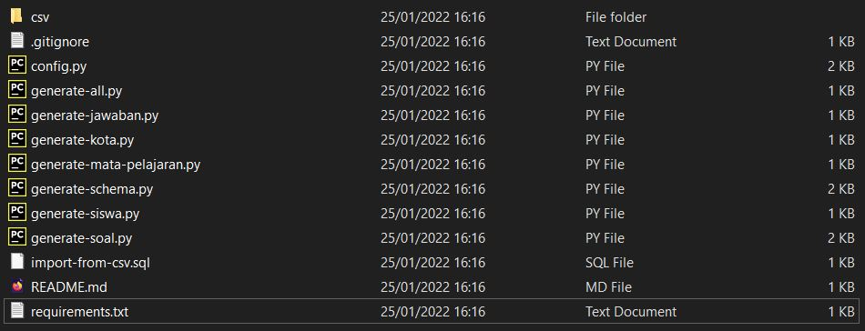<br><br>
3. Install library yang terdapat pada file requirements.txt dengan command ```pip install -r requirements.txt``` pada cmd<br><br>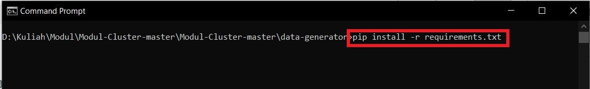<br><br>
4. Pastikan XAMPP sudah menyala dan tekan tombol shell untuk masuk ke dalam shell<br><br>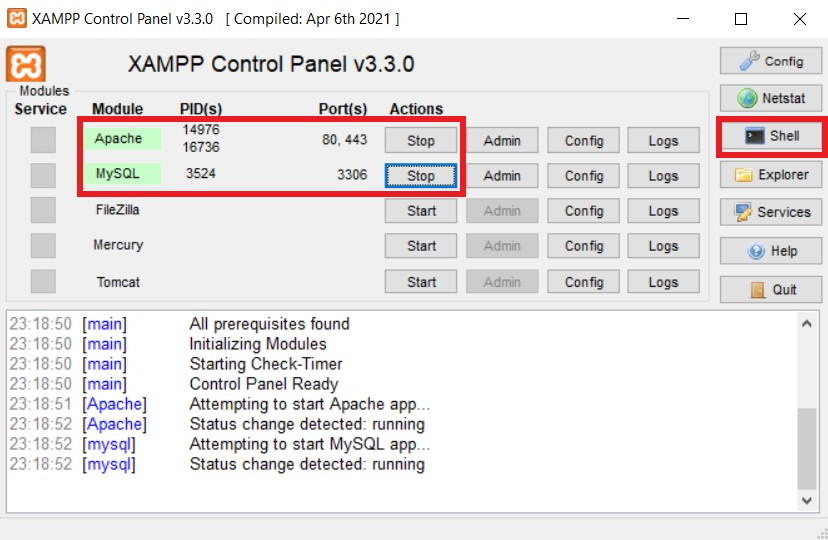<br><br>
5. Buat database dengan command ```mysql -u root -e "drop database if exists CBT_JATIM; create database CBT_JATIM;"```<br><br>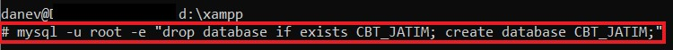<br><br>
6. Setelah itu pada phpmyadmin bisa kita lihat bahwa kita mendapatkan sebuah database baru bernama CBT_JATIM<br><br><br><br>
7. Generate Schema dengan command ```python generate-schema.py``` di command prompt<br><br><br><br>
8. Setelah itu kita akan mendapati bahwa di database CBT_JATIM akan muncul beberapa tabel baru<br><br>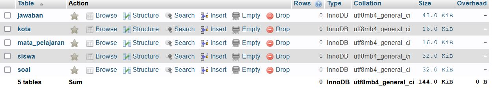<br><br>
9. Generate data dengan command ```python generate-all.py```<br><br>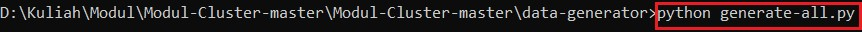<br><br>
10. Maka pada folder csv kita mendapatkan beberapa file csv<br><br><br><br>
11. Terakhir masukkan command ```mysql -u root < import-from-csv.sql``` di shell yang terbuka melalui XAMPP untuk mengimport csv ke mysql<br><br>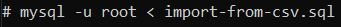<br><br>
12. Maka pada tabel, kita akan mendapatkan data yang sudah terisi<br><br>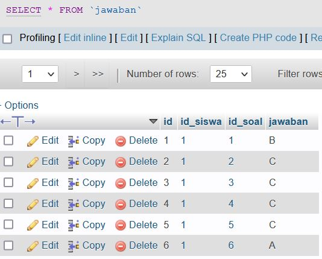<br><br>

## 5. Query Nilai Siswa dari Big Data
Dari data tersebut kita akan mencoba untuk mengolah jawaban sehingga kita mendapatkan jumlah jawaban yang benar dari tiap siswa dengan cara sebagai berikut :
1. Buat sebuah tabel baru bernama nilai dengan kolom sebagai berikut<br><br>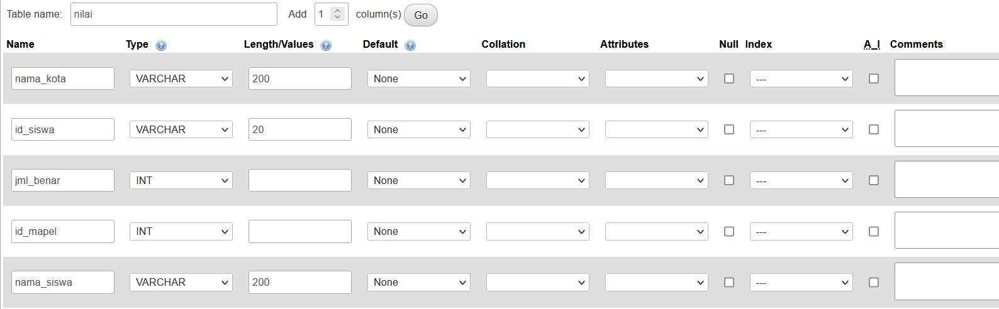<br><br>
2. Jalankan query berikut untuk mendapatkan nilai dari tiap siswa<br><br>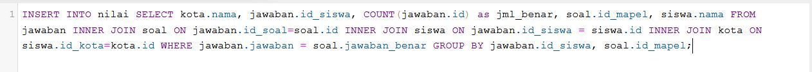<br><br>
```sql
INSERT INTO nilai SELECT kota.nama, jawaban.id_siswa, COUNT(jawaban.id) as jml_benar, soal.id_mapel, siswa.nama FROM jawaban INNER JOIN soal ON jawaban.id_soal=soal.id INNER JOIN siswa ON jawaban.id_siswa = siswa.id INNER JOIN kota ON siswa.id_kota=kota.id WHERE jawaban.jawaban = soal.jawaban_benar GROUP BY jawaban.id_siswa, soal.id_mapel;
```
Penjelasan :
- ```INSERT INTO nilai``` : Memasukkan data ke dalam tabel nilai
- ```SELECT``` : memilih data (nantinya hasil select ini akan di insert ke dalam tabel nilai)
- ```kota.nama``` : memilih kolom nama pada tabel kota
- ```jawaban.id_siswa``` : memilih kolom id_siswa dari tabel jawaban
- ```COUNT(jawaban.id) as jml_benar``` : menghitung jumlah id_jawaban yang ada dan menyimpannya dengan nama jml_benar
- ```soal.id_mapel``` : memilih kolom id_mapel pada tabel soal
- ```siswa.nama``` : memilih kolom nama pada tabel siswa
- ```FROM jawaban``` : mengambil data dari kolom jawaban
- ```INNER JOIN soal``` : menggabungkan dengan tabel soal menggunakan metode INNER JOIN
- ```ON jawaban.id_soal=soal.id``` : untuk menggabungkan tabel jawaban pada kolom id_soal dan tabel soal pada kolom id
- ```INNER JOIN siswa``` : menggabungkan dengan tabel siswa
- ```ON jawaban.id_siswa = siswa.id``` : menggabungkan tabel jawaban pada kolom id_siswa dan tabel siswa pada kolom id
- ```INNER JOIN kota``` : menggabungkan dengan tabel kota
- ```ON siswa.id_kota=kota.id``` : menggabungkan tabel siswa pada kolom id_kota dan tabel kota pada kolom id
- ```WHERE jawaban.jawaban = soal.jawaban_benar``` : Hanya lakukan select pada data yang memiliki nilai yang sama pada tabel jawaban kolom jawaban dan tabel soal kolom jawaban_benar
- ```GROUP BY jawaban.id_siswa, soal.id_mapel``` : grouping data berdasarkan tabel jawaban kolom id_siswa dan tabel soal kolom id_mapel
7. Maka kita akan mendapatkan jumlah jawaban yang benar dari tiap siswa<br><br>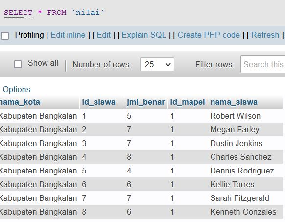<br><br>

## Referensi
https://idcloudhost.com/kamus-hosting/query/ <br>
https://www.dicoding.com/blog/apa-itu-database/ <br>
https://catatanshand.blogspot.com/2018/01/pengertian-fungsi-dan-macam-macam-jenis-database.html <br>
http://belajarlazarus.blogspot.com/2016/08/inilah-kelebihan-dan-kekurangan-sqlite.html <br>
https://glints.com/id/lowongan/kelebihan-kekurangan-mongodb/#.YeLNQfgxVPY <br>
https://webhostmu.com/cara-install-xampp/ <br>
https://www.niagahoster.co.id/blog/cara-membuat-database-di-mysql/ <br>
