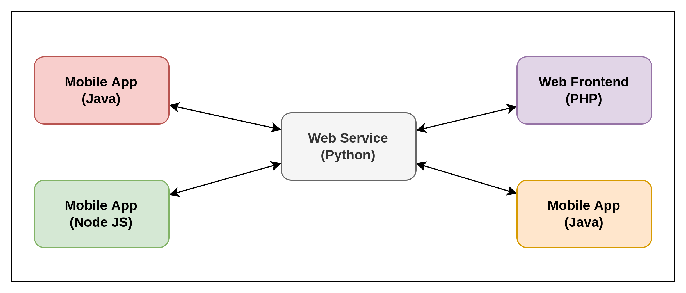
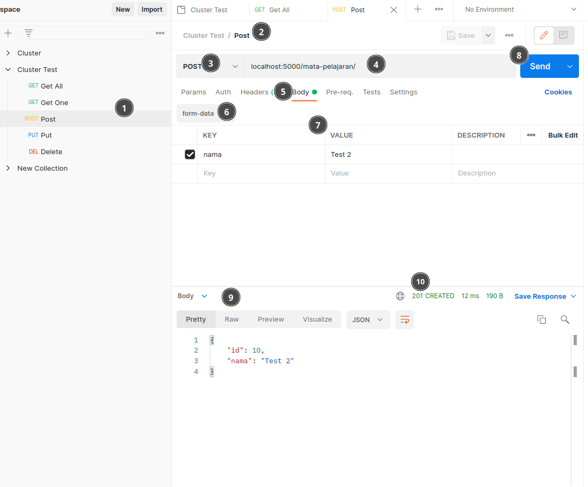
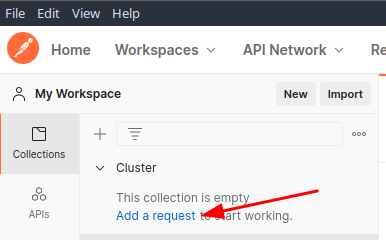
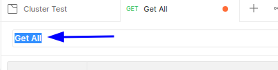
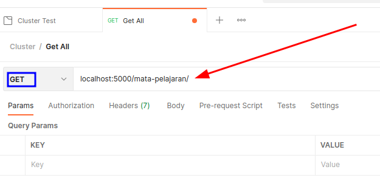
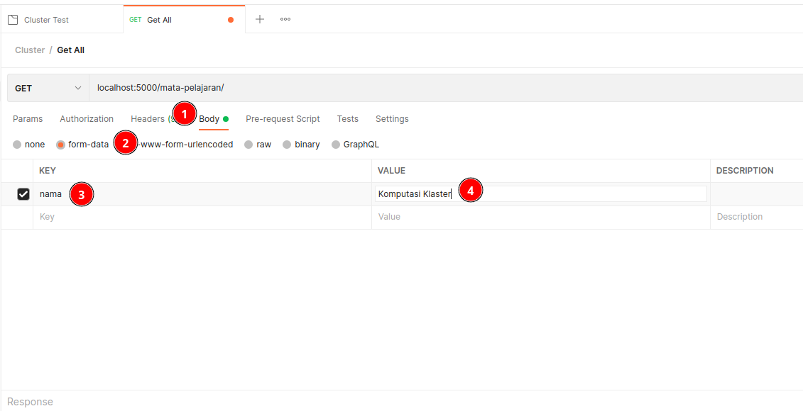
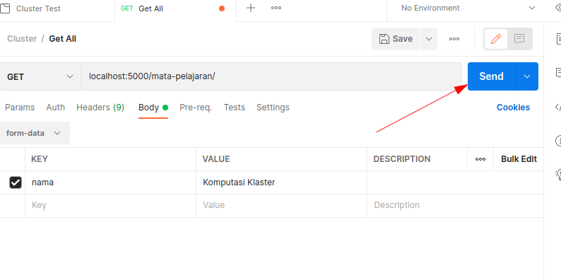
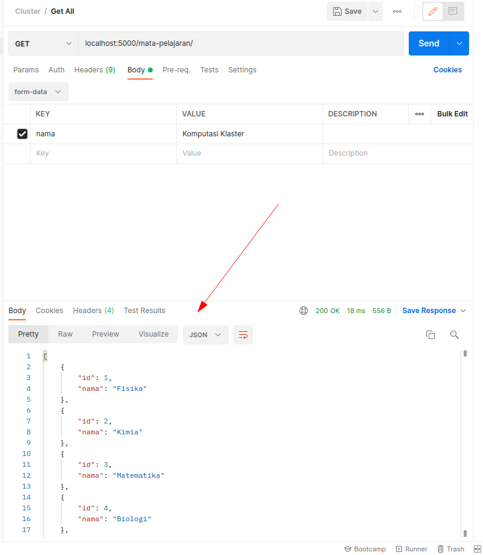
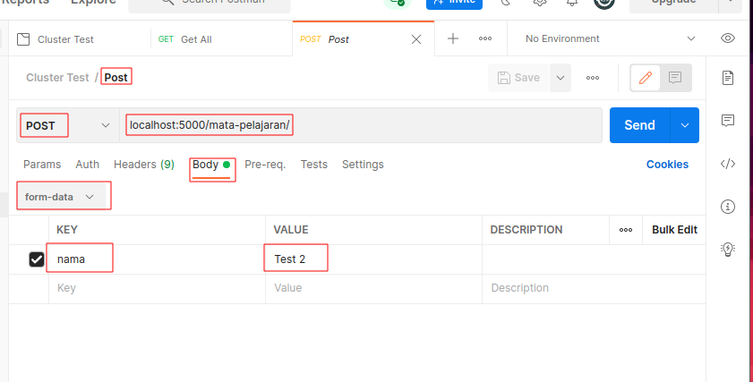
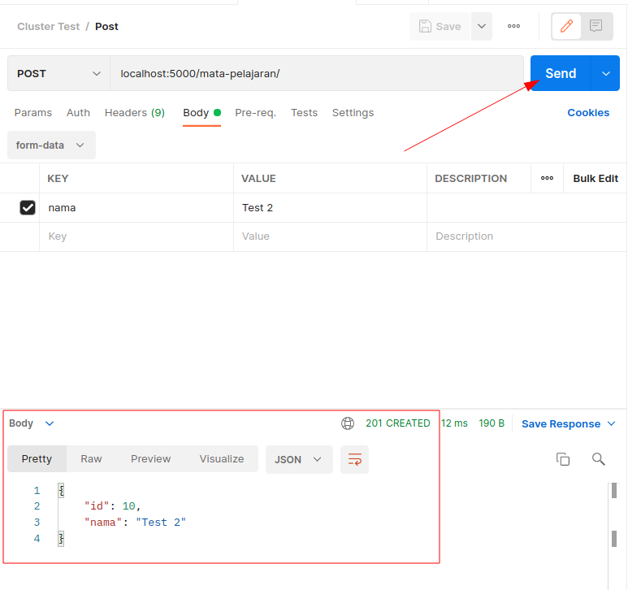

# Outline

- [Outline](#outline)
- [Tujuan](#tujuan)
- [Pengenalan Web Service](#pengenalan-web-service)
- [Jenis](#jenis)
  - [XML-RPC (Remote Procedure Call)](#xml-rpc-remote-procedure-call)
    - [Tag tipe data (data-type) dalam XML-RPC](#tag-tipe-data-data-type-dalam-xml-rpc)
    - [SOAP (Simple Object Access Protocol)](#soap-simple-object-access-protocol)
    - [REST (Representational State Transfer)](#rest-representational-state-transfer)
- [Bagaimana Web Service Bekerja](#bagaimana-web-service-bekerja)
  - [Alur Web Service](#alur-web-service)
  - [Struktur HTTP](#struktur-http)
    - [Start Line](#start-line)
    - [Request Headers](#request-headers)
    - [Body](#body)
  - [HTTP Methods](#http-methods)
    - [GET](#get)
    - [HEAD](#head)
    - [POST](#post)
    - [PUT](#put)
    - [PATCH](#patch)
    - [DELETE](#delete)
    - [Dengan operasi CRUD](#dengan-operasi-crud)
    - [Method Lain](#method-lain)
  - [HTTP Status Code](#http-status-code)
- [Instalasi Postman](#instalasi-postman)
- [Web Service Menggunakan python](#web-service-menggunakan-python)
  - [Install Dependencies](#install-dependencies)
  - [Import Module dan Initial Setup](#import-module-dan-initial-setup)
- [Testing menggunakan Postman](#testing-menggunakan-postman)
  - [User Interface](#user-interface)
  - [Contoh Pengujian GET 1](#contoh-pengujian-get-1)
  - [Contoh Pengujian POST](#contoh-pengujian-post)
- [Latihan](#latihan)
- [Referensi](#referensi)

# Tujuan
Tujuan dibuatnya modul ini adalah untuk memperkenalkan pembaca mengenai hal yang terkait dengan *Web Service*, dimulai dari jenis-jenis hingga pembuatan *Web Service* menggunakan bahasa pemrograman Python.

# Pengenalan Web Service
Web Service adalah sebuah aplikasi berbasis **client-server** atau **consumer-provider** yang dapat digunakan untuk menjembatani banyak aplikasi untuk saling **berkomunikasi** satu sama lain __tanpa dibatasi oleh bahasa pemrograman__ tertentu. Dalam Web Service, sebuah *teknologi web* seperti **HTTP** digunakan untuk mengirimkan file dengan format machine-readable seperti **XML** atau **JSON**.

Secara singkat, Web Service dapat didefinisikan sebagai berikut:
- Sebuah layanan yang tersedia melalui internet
- Merupakan aplikasi client-server atau komponen aplikasi untuk komunikasi.
- Client mengirimkan request ke server (service), dan service mengirimkan response ke client.
- Kumpulan standar atau protokol untuk bertukar informasi antara dua perangkat atau aplikasi.



Gambar diatas menunjukkan bagaimana aplikasi-aplikasi yang ditulis dengan berbagai bahasa dapat **saling berinteraksi** antar satu sama lain ataupun dengan Web Service itu sendiri. Interaksi ini dapat berupa permintaan data, mengirimkan notifikasi, atau mengeksekusi instruksi dari aplikasi tersebut.

# Jenis
## XML-RPC (Remote Procedure Call)
Protokol XML paling dasar untuk bertukar data antara berbagai perangkat di jaringan. XML-RPC menggunakan HTTP untuk dapat dengan cepat dan mudah berkomunikasi  dari klien ke server dan sebaliknya. Dalam XML-RPC interaksi ini dilakukan dengan mengirim **dokumen xml** yang didalamnya berisi **metode dan parameter dari permintaan yang diinginkan**.

Seperti namanya XML-RPC memanfaatkan komunikasi **RPC** (Remote Procedure Call) dimana satu komputer dapat membuat komputer lain mengeksekusi sebuah fungsi/subroutine seakan akan dilakukan oleh komputer lain tersebut. Berbeda dengan **IPC** (Inter-process communication) dimana sebuah proses berkomunikasi dengan process lain **didalam komputer/host machine yang sama**.

**Contoh Request XML-RPC**:
```xml
<?xml version="1.0"?>
<methodCall>
  <methodName>examples.getStateName</methodName>
  <params>
    <param>
        <value><i4>40</i4></value>
    </param>
  </params>
</methodCall>
```

Dapat dilihat dalam contoh request tersebut terdapat tag `<methodCall>` yang memberikan informasi bahwa didalam tag tersebut akan ada nama *method* yang ingin dipanggil dan *parameter* apa saja yang diberikan. Dalam tag `<methodName>` ada nama method yang ingin dipanggil. Method ini sendiri dapat berupa *fungsi/function* dalam pemrograman yang bertugas untuk melakukan intruksi-intruksi tertentu. Dalam tag `<params>` berisi *parameter* yang diberikan, parameter ini dapat dianggap seperti argumen dalam yang akan digunakan dalam *function* yang dipanggil pada `<methodName>`.

**Contoh Response XML-RPC**:
```xml
<?xml version="1.0"?>
<methodResponse>
  <params>
    <param>
        <value><string>South Dakota</string></value>
    </param>
  </params>
</methodResponse>
```

Ketika request dari client ini **berhasil diproses** oleh server, server akan mengirimkan kembali response dari request yang diberikan tadi sesuai dengan *method* dan *parameter* yang diberikan. Dalam contoh request tadi client mengirimkan request untuk meminta data **negara bagian** (state) dengan id `40` (dilihat dari parameter request), maka server memberikan response berupa string yang berisi `South Dakota`. Client akan menerima response yang dikirim oleh server ini.

**Contoh Fault/Error Response XML-RPC**:
```xml
<?xml version="1.0"?>
<methodResponse>
  <fault>
    <value>
      <struct>
        <member>
          <name>faultCode</name>
          <value><int>4</int></value>
        </member>
        <member>
          <name>faultString</name>
          <value><string>Too many parameters.</string></value>
        </member>
      </struct>
    </value>
  </fault>
</methodResponse>
```

Tentu saja akan ada kemungkinan client mengirimkan **request yang tidak sesuai**, kadang melakukan request pada data yang tidak tersedia, atau request yang dikirim tidak memiliki struktur yang benar. Server harus tetap dapat menangani request ini, proses ini disebut sebagai **Error Handling**, dalam kasus ini **client mengirimkan request dengan parameter berlebih** sehingga server tidak dapat memroses data tersebut. Server akan mengirimkan sebuah *Error Message* yang sesuai sehingga client dapat mengetahui error tersebut.

### Tag tipe data (data-type) dalam XML-RPC
- **Array**

```xml
<array>
  <data>
    <value><i4>1404</i4></value>
    <value><string>Something here</string></value>
    <value><i4>1</i4></value>
  </data>
</array>
```

> *Array of values*, tidak menyimpan `key`

- **Base64**
```xml
<base64>eW91IGNhbid0IHJlYWQgdGhpcyE=</base64>
```
> Data biner yang *di-encode* Base64

- **Boolean**
```xml
<boolean>1</boolean>
```
> Boolean logical value (0 atau 1)

- **Date/Time**
```xml
<dateTime.iso8601>19980717T14:08:55Z</dateTime.iso8601>
```
> Date and time in ISO 8601 format

- **Double**
```xml
<double>-12.53</double>
```
> Angka floating point presisi double

- **Integer**
```xml
<int>42</int>
```
> Atau

```xml
<i4>42</i4>
```
> Bilangan bulat, integer.

- **String**
```xml
<string>Hello world!</string>
```
> atau

```xml
Hello world!
```
> Rangkaian karakter. Harus mengikuti *encoding* XML.

- **Struct**
```xml
<struct>
  <member>
    <name>foo</name>
    <value><i4>1</i4></value>
  </member>
  <member>
    <name>bar</name>
    <value><i4>2</i4></value>
  </member>
</struct>
```
> Associative array

- **nil**
```xml
<nil/>
```

> Nilai nil; ekstensi XML-RPC

<br><br>


### SOAP (Simple Object Access Protocol)
Protokol layanan Web berbasis XML untuk bertukar data dan dokumen melalui HTTP atau SMTP (Simple Mail Transfer Protocol). Ini memungkinkan proses yang beroperasi pada sistem yang berbeda untuk berkomunikasi menggunakan XML.

Berikut adalah contoh `request` menggunakan SOAP:
```xml
POST /Quotation HTTP/1.0
Host: www.xyz.org
Content-Type: text/xml; charset = utf-8
Content-Length: nnn

<?xml version = "1.0"?>
<SOAP-ENV:Envelope
   xmlns:SOAP-ENV = "http://www.w3.org/2001/12/soap-envelope"
   SOAP-ENV:encodingStyle = "http://www.w3.org/2001/12/soap-encoding">

   <SOAP-ENV:Body xmlns:m = "http://www.xyz.org/quotations">
      <m:GetQuotation>
         <m:QuotationsName>MiscroSoft</m:QuotationsName>
      </m:GetQuotation>
   </SOAP-ENV:Body>
</SOAP-ENV:Envelope>
```

Berikut adalah contoh `response` dari SOAP:
```xml
HTTP/1.0 200 OK
Content-Type: text/xml; charset = utf-8
Content-Length: nnn

<?xml version = "1.0"?>
<SOAP-ENV:Envelope
   xmlns:SOAP-ENV = "http://www.w3.org/2001/12/soap-envelope"
   SOAP-ENV:encodingStyle = "http://www.w3.org/2001/12/soap-encoding">

   <SOAP-ENV:Body xmlns:m = "http://www.xyz.org/quotation">
      <m:GetQuotationResponse>
         <m:Quotation>Here is the quotation</m:Quotation>
      </m:GetQuotationResponse>
   </SOAP-ENV:Body>
</SOAP-ENV:Envelope>
```

### REST (Representational State Transfer)
Menyediakan komunikasi dan konektivitas antara perangkat dan internet berbasis API. Sebagian besar layanan RESTful menggunakan HTTP sebagai protokol pendukungnya. Penejelasan lebih lanjut mengenai REST akan **dibahas di bagian [Bagaimana Web Service Bekerja](#bagaimana-web-service-bekerja)**.

# Bagaimana Web Service Bekerja
Salah satu cara Web Service berinteraksi yaitu melalui protokol HTTP/HTTPS, Ada satu atau sekumpulan komputer yang bertindak sebagai client yang akan mengirimkan permintaan (request) kepada server dengan method-method (**HTTP Methods**) yang ada dan server akan mengirimkan data kembali (response) kepada client diikuti dengan kode status (**HTTP Status Code**).

## Alur Web Service

-> Flowl Website (client adalah user)
  - client mengunjungi url tertentu di browser
  - browser mengirimkan request ke server dengan method `get`
  - server menerima request dan mengirimkan halaman yang diminta ke client
  - browser menerima response dari server
  - browser menampilkan (*render*) halaman yang diterima dari server
  - client melihat halaman yang sudah ditampilkan (*render*)

-> Flow Webservice (client dapat berupa user ataupun aplikasi lain)
  - client mengirimkan request ke server
  - server menerima request dan melakukan parsing request
  - server melakukan operasi yang diminta pada request
  - server mengirimkan response ke client
  - client menerima response dan melakukan parsing response

Dapat dilihat pada flow diatas sebenarnya alur dari proses Web Service mirip dengan alur proses Website, perbedannya hanya pada permintaan dalam website, ada peran browser untuk me-render halaman yang didapatkan.

## Struktur HTTP

Pada bentuk aslinya, sebuah HTTP Request atau bisa disebut juga HTTP Message berbentuk beberapa baris *plain-text* yang dikirimkan oleh client dan server. Oleh karena bentuknya yang hanya berupa plain-text, kita dapat mengirimkannya melalui tools command-line seperti [curl](https://en.wikipedia.org/wiki/CURL). Meskipun demikian, untuk mempermudah interaksi yang melibatkan HTTP Requests, biasanya kita menggunakan tools lain seperti [postman](https://getpostman.com), atau [insomnia](https://insomnia.rest/), tools-tools tersebut biasa disebut sebagai **HTTP Client**.

Meskipun pada akhirnya kita akan menggunakan tools atau bahasa pemrograman untuk berinteraksi melalui HTTP, ada baiknya kita memahami bagaimana sebuah HTTP Message itu dibentuk.


> `request` - permintaan dari *client* ke *server*, `response` - balasan dari *server* ke *client*

Dapat dilihat pada gambar di atas, pada `request` dan `response` dari HTTP terdapat struktur yang sama yaitu: `start-line`, `HTTP Headers`, `empty-line/baris kosong`, dan `body`.

### Start Line
Pada bagian start-line terdapat tiga bagian yaitu:
- **HTTP Method** (dibahas pada bagian [HTTP Method](#http-methods)), sebuah kata kerja seperti GET, PUT, POST, atau kata benda seperti HEAD, atau OPTIONS, yang mendeskripsikan action apa yang perlu dilakukan. Misal, GET menandakan bahwa sebuah *resource* harus diambil, atau POST memandakan bahwa sebuah *resource* harus ditambahkan ke server.
- **Request Target**, biasanya sebuah URL, path absolute, port, atau domain.
- **HTTP Version**, yang menandakan versi HTTP yang digunakan.

<div>
  
  <div align="center"><b>Contoh request HTTP</b></div>
</div>

<div>
  
  <div align="center"><b>Contoh response HTTP</b></div>
</div>

### Request Headers

Header HTTP memungkinkan client dan server menyampaikan informasi tambahan dari `request` atau `response` HTTP. Header terdiri dari nama case-insensitive diikuti oleh titik dua (:), kemudian dengan nilainya. Spasi sebelum nilai diabaikan.

> Jika kita melihat headers dengan prefix nama `X-`, berarti header tersebut merupakan header *custom* (vendor-specific), contoh `X-Archived-At`, `X-Forwarded-For`, dsb.


- **General Header**: Header HTTP yang dapat digunakan dalam `request` dan `response`, tidak berhubungan dengan konten/body yang dikirimkan.
- **Request Header**: Digunakan dalam `request` untuk memberikan informasi tentang konteks permintaan, sehingga server dapat menyesuaikan `response`.
> Misalnya, header `Accept-*` menunjukkan format respons yang diizinkan. Header lain dapat digunakan untuk memberikan kredensial atau authentication, atau untuk mendapatkan informasi tentang *user-agent* atau perujuk, dll.

- **Representation Header**: Header HTTP yang menjelaskan representasi spesifik dari `resource` yang dikirim pada `body` HTTP. Contoh dari representation header yaitu: `Content-Type`, `Content-Encoding`, `Content-Language`, dan `Content-Location`.

### Body

Bagian terakhir adalah `body`. Tidak semua `request`/`response` memilikinya: `request` yang mengambil `resource`, seperti `GET`, `HEAD`, `DELETE`, atau `OPTIONS`, biasanya tidak memerlukannya. Beberapa request yang mengirim data ke server untuk seperti `POST`.

Body biasanya dikirimkan dalam bentuk `plain-text` (json, xml, html), `binary`, atau `multipart`.


Body adalah bagian terakhir dari HTTP Message.


## HTTP Methods
Dalam protokol HTTP, ada berbagai **method** yang dapat digunakan untuk meminta data (request) ke server. Setiap **method** ini sudah memliki standarisasi kegunaanya, misalnya seperti `GET` untuk meminta data, dan `POST` untuk mengirimkan data. Tetapi, hal ini bukan menjadi aturan yang harus diikuti, dalam artian kita dapat mengirimkan data menggunakan `GET`, hal tadi hanyalah sebuah standar spesifikasi untuk menyamakan struktur dari Web Service atau API yang kita ingin buat.

Berikut adalah method-method yang ada dalam HTTP:

### GET
Metode HTTP GET digunakan untuk **membaca** (atau mengambil) *resource*.
Pada path yang benar, GET mengembalikan representasi data dalam XML atau JSON dan *response code* `HTTP 200 (OK)`.
Dalam path salah, GET umumnya mengembalikan `404 (Not Found)` atau `400 (Bad Request)`.

Menurut desain spesifikasi HTTP, permintaan GET (bersama dengan HEAD) hanya digunakan untuk membaca data dan tidak mengubahnya. Jangan mengekspos operasi yang tidak aman melalui GET seperti password dan data sensitif lainnya.

Contoh:  
```
GET http://www.example.com/customers/12345  
GET http://www.example.com/customers/12345/orders  
GET http://www.example.com/buckets/sample  
```

### HEAD
Metode HEAD meminta respons yang identik dengan permintaan GET, tetapi tanpa isi respons (response body).

### POST
Metode POST mengirimkan entitas ke *resource* yang ditentukan, sering kali menyebabkan perubahan status atau `side-effect` pada server.
Pada pembuatan yang berhasil, server akan mengirimkan status HTTP 201(Created), atau header Lokasi dengan link ke resource yang baru dibuat dengan status HTTP 201. Misal kita POST /user, maka dapat me-return /user/1, dimana user identifier `1` adalah user yang baru saja kita buat.

Contoh:  
```
POST http://www.example.com/customers  
POST http://www.example.com/customers/12345/orders  
```

### PUT
Metode PUT menggantikan semua representasi saat ini dari *resource* target dengan payload permintaan. PUT paling sering digunakan untuk melakukan **update**, mengirimkan PUT ke URI yang dikenal dengan `request body` yang berisi data resource asli yang sudah di modifikasi.

Misal data asli:
```json
{
  "id": 1,
  "name": "John Doe",
  "address": "Indonesia",
  "age": 30
}
```

Lakukan PUT ke `/user/1` dengan `request body`:
```json
{
  "id": 1,
  "name": "John Doe Aja",
  "address": "Bekasi",
  "age": 31
}
```
Akan mengganti user dengan id `1` dengan data baru yang dikirimkan.

Contoh:  
```
PUT http://www.example.com/customers/12345  
PUT http://www.example.com/customers/12345/orders/98765  
PUT http://www.example.com/buckets/secret_stuff  
```

### PATCH
Metode PATCH menerapkan modifikasi parsial pada *resource*. Permintaan PATCH hanya perlu berisi perubahan pada `resource`, bukan `resource` yang lengkap.

Misal data asli:
```json
{
  "id": 1,
  "name": "John Doe",
  "address": "Indonesia",
  "age": 30
}
```

Lakukan PUT ke `/user/1` dengan `request body`:
```json
{
  "name": "John Doe Aja",
  "age":  68
}
```
Akan **mengubah nama dan usia** user dengan id `1` dengan data baru yang dikirimkan, tanpa mengubah data lain yang tidak menjadi `request body`.

Contoh:  
```
PATCH http://www.example.com/customers/12345  
PATCH http://www.example.com/customers/12345/orders/98765  
PATCH http://www.example.com/buckets/secret_stuff  
```

### DELETE
Metode DELETE menghapus *resource* yang ditentukan.

Pada proses DELETE yang berhasil, server dapat mengirimkan status HTTP 200 (OK) dengan `response body` yang berisi data yang dihapus (tetapi sering dianggap membuang-buang bandwith), atau status HTTP 204 (No Content) tanpa `response body` untuk menandakan data telah berhasil dihapus.

Contoh:  
```
DELETE http://www.example.com/customers/12345  
DELETE http://www.example.com/customers/12345/orders  
DELETE http://www.example.com/bucket/sample  
```

### Dengan operasi CRUD
Berikut adalah tabel method yang paling umum digunakan beserta *use-case* dan response nya nya:
<table>
    <thead>
        <tr>
            <th rowspan=2>Method</th>
            <th rowspan=2>CRUD</th>
            <th colspan=2>Response</th>
        </tr>
        <tr>
          <th>Koleksi Data <br> <code>/siswa</code></th>
          <th>Data Spesifik <br> <code>/siswa/{id}</code></th>
        </tr>
    </thead>
    <tbody>
        <tr>
            <td>POST</td>
            <td>Create</td>
            <td>
              <code>201 (Created)</code>, 'Location' header with link to /customers/{id} containing new ID.
            </td>
            <td>
              <code>404 (Not Found)</code>, <code>409 (Conflict)</code> if resource already exists.
            </td>
        </tr>
        <tr>
            <td>GET</td>
            <td>Read</td>
            <td>
              <code>200 (OK)</code>, list of customers. Use pagination, sorting and filtering to navigate big lists.
            </td>
            <td>
              <code>200 (OK)</code> single customer.
              <code>404 (Not Found)</code> if ID not found or invalid.
            </td>
        </tr>
        <tr>
          <td>PUT</td>
          <td>Update/Replace</td>
          <td><code>405 (Method Not Allowed)</code>, unless you want to update/replace every resource in the entire collection.</td>
          <td>
          <code>200 (OK)</code> or <code>204 (No Content)</code>. <code>404 (Not Found)</code> if ID not found or invalid.
          </td>
        </tr>
        <tr>
          <td>PATCH</td>
          <td>Update/Modify</td>
          <td><code>405 (Method Not Allowed)</code>, unless you want to modify the collection itself.</td>
          <td><code>200 (OK) or 204 (No Content)</code>. <code>404 (Not Found)</code>, if ID not found or invalid.</td>
        </tr>
        <tr>
          <td>DELETE</td>
          <td>Delete</td>
          <td><code>405 (Method Not Allowed)</code>, unless you want to delete the whole collection—not often desirable.</td>
          <td><code>200 (OK)</code>. <code>404 (Not Found)</code>, if ID not found or invalid.</td>
        </tr>
    </tbody>
</table>


### Method Lain
Selain method diatas, ada beberapa method lain yang dapat digunakan seperti:  
**CONNECT**: Metode CONNECT membuat tunnel ke server yang diidentifikasi oleh *resource* target.  
**OPTIONS**: Metode OPTIONS menjelaskan opsi komunikasi untuk *resource* target.  
**TRACE**: Metode TRACE melakukan tes loop-back pesan di sepanjang jalur ke *resource* target.  

## HTTP Status Code
Pada setiap response yang dikirimkan oleh server, akan terdapat status code yang menunjukkan status dari proses request.
Semua status code respons HTTP dipisahkan menjadi **lima kelas atau kategori**. Digit pertama kode status mendefinisikan kelas respons, sedangkan dua digit terakhir tidak memiliki peran klasifikasi atau kategorisasi.

Ada lima kelas yang ditentukan oleh standar:
<details>
<summary><b>1xx informational response</b> – permintaan diterima, proses berlanjut</summary>

| Status code       | Meaning             |
| ---               | ---                 |
| 100               | Continue            |
| 101               | Switching protocols |
| 102               | Processing          |
| 103               | Early Hints         |
</details>

<details>
<summary><b>2xx successful</b> – permintaan berhasil diterima, dipahami, dan diterima</summary>

| Status code       | Meaning             |
| ---               | ---                 |
| 200           | OK                            |
| 201           | Created                       |
| 202           | Accepted                      |
| 203           | Non-Authoritative Information |
| 204           | No Content                    |
| 205           | Reset Content                 |
| 206           | Partial Content               |
| 207           | Multi-Status                  |
| 208           | Already Reported              |
| 226           | IM Used                       |
</details>

<details>
<summary><b>3xx redirection</b> – tindakan lebih lanjut perlu diambil untuk menyelesaikan permintaan</summary>

| Status code       | Meaning             |
| ---               | ---                 |
| 300               | Multiple Choices    |
| 301               | Moved Permanently   |
| 302             | Found (Previously "Moved Temporarily") |
| 303             | See Other                              |
| 304             | Not Modified                           |
| 305             | Use Proxy                              |
| 306             | Switch Proxy                           |
| 307             | Temporary Redirect                     |
| 308             | Permanent Redirect                     |
</details>

<details>
<summary><b>4xx client error</b> – permintaan mengandung sintaks yang buruk atau tidak dapat dipenuhi</summary>

| Status code       | Meaning             |
| ---               | ---                 |
| 400              | Bad Request                     |
| 401              | Unauthorized                    |
| 402              | Payment Required                |
| 403              | Forbidden                       |
| 404              | Not Found                       |
| 405              | Method Not Allowed              |
| 406              | Not Acceptable                  |
| 407              | Proxy Authentication Required   |
| 408              | Request Timeout                 |
| 409              | Conflict                        |
| 410              | Gone                            |
| 411              | Length Required                 |
| 412              | Precondition Failed             |
| 413              | Payload Too Large               |
| 414              | URI Too Long                    |
| 415              | Unsupported Media Type          |
| 416              | Range Not Satisfiable           |
| 417              | Expectation Failed              |
| 418              | I'm a Teapot                    |
| 421              | Misdirected Request             |
| 422              | Unprocessable Entity            |
| 423              | Locked                          |
| 424              | Failed Dependency               |
| 425              | Too Early                       |
| 426              | Upgrade Required                |
| 428              | Precondition Required           |
| 429              | Too Many Requests               |
| 431              | Request Header Fields Too Large |
| 451              | Unavailable For Legal Reasons   |
</details>

<details>
<summary><b>5xx server error</b> – server gagal memenuhi permintaan yang tampaknya valid</summary>

| Status code       | Meaning             |
| ---               | ---                 |
| 500              | Internal Server Error           |
| 501              | Not Implemented                 |
| 502              | Bad Gateway                     |
| 503              | Service Unavailable             |
| 504              | Gateway Timeout                 |
| 505              | HTTP Version Not Supported      |
| 506              | Variant Also Negotiates         |
| 507              | Insufficient Storage            |
| 508              | Loop Detected                   |
| 510              | Not Extended                    |
| 511              | Network Authentication Required |
</details>

Untuk informasi lebih detail dapat dilihat di [HTTP Status Code](https://en.wikipedia.org/wiki/List_of_HTTP_status_codes)

# Instalasi Postman
Postman adalah sebuah HTTP Client, HTTP Client adalah sebuah program yang dapat digunakan untuk berinteraksi dengan sebuah web-service berbasis HTTP. Biasanya, postman juga menjadi *tools* yang digunakan oleh *developer* untuk melakukan testing dari sebuah *RESTful API* (API Berbasiskan REST - HTTP). Dalam modul ini nanti Postman akan digunakan untuk berinteraksi dengan web-service yang akan dibuat.

Berikut adalah cara melakukan instalasi Postman:

1. Download installer Postman di [https://www.getpostman.com/](https://www.getpostman.com/)

<span style="overflow: hidden; display: inline-block; margin: 0.00px 0.00px; border: 0.00px solid #000000; transform: rotate(0.00rad) translateZ(0px); -webkit-transform: rotate(0.00rad) translateZ(0px); width: 601.70px; height: 309.33px;"></span>

2. Install Postman di komputer Anda
<span style="overflow: hidden; display: inline-block; margin: 0.00px 0.00px; border: 0.00px solid #000000; transform: rotate(0.00rad) translateZ(0px); -webkit-transform: rotate(0.00rad) translateZ(0px); width: 601.70px; height: 342.67px;"></span>


3. Setelah instalasi selesai, kita dapat memilih untuk log-in menggunakan account atau langsung menggunakan aplikasi tanpa perlu membuat account.

<span style="overflow: hidden; display: inline-block; margin: 0.00px 0.00px; border: 0.00px solid #000000; transform: rotate(0.00rad) translateZ(0px); -webkit-transform: rotate(0.00rad) translateZ(0px); width: 601.70px; height: 372.00px;"></span>

4. Jika ingin membuat akun silahkan isi data-data dan tipe akun yang ingin dibuat.

<span style="overflow: hidden; display: inline-block; margin: 0.00px 0.00px; border: 0.00px solid #000000; transform: rotate(0.00rad) translateZ(0px); -webkit-transform: rotate(0.00rad) translateZ(0px); width: 601.70px; height: 496.00px;"></span>

5.  Postman sudah selesai di install.

<span style="overflow: hidden; display: inline-block; margin: 0.00px 0.00px; border: 0.00px solid #000000; transform: rotate(0.00rad) translateZ(0px); -webkit-transform: rotate(0.00rad) translateZ(0px); width: 601.70px; height: 320.00px;"></span>


# Web Service Menggunakan python

Pada modul ini, kita akan membuat Web Service sederhana menggunakan python dan flask. Web Service ini menggunakan sistem REST API (dengan bantuan flask-restful).

> Pastikan sudah terinstall python version 3.9 atau lebih tinggi.
> Pastikan sudah terinstall mysql dan sudah berfungsi (xampp/wamp/service).
> Pastikan sudah melakukan import database dari modul sebelumnya.

## Install Dependencies

**Install virtualenv**

```
$ pip install virtualenv
$ virtualenv venv
```

> tulis tanpa tanda dollar, `$` hanya menandakan bahwa perintah tersebut dijalankan di terminal.

<br>

**Masuk ke virtualenv (aktivasi virtual environment)**

```
$ venv\Scripts\activate
```

**Buat file `requirements.txt` lalu isikan dengan**

```
aniso8601==9.0.1
click==8.0.3
Flask==2.0.2
Flask-RESTful==0.3.9
Flask-SQLAlchemy==2.5.1
greenlet==1.1.2
itsdangerous==2.0.1
Jinja2==3.0.3
MarkupSafe==2.0.1
mysqlclient==2.1.0
pytz==2021.3
six==1.16.0
SQLAlchemy==1.4.31
Werkzeug==2.0.2
```

**Install requirements**

`$ pip install -r requirements.txt`

## Import Module dan Initial Setup
**Buat file `server.py`**
Silahkan buat file `server.py` dengan setelah masuk ke virtual environment.

**Import Module**
```python
from flask import Flask
from flask_restful import Api, Resource, reqparse, abort, fields, marshal_with
from flask_sqlalchemy import SQLAlchemy
```

`Flask` adalah library yang kita gunakan untuk membuat aplikasi web menggunakan python.
`flask_resful` adalah 'extension' dari `Flask` yang kita gunakan untuk membuat API menggunakan RESTful API.
`flask_sqlalchemy` adalah 'extension' dari `Flask` yang kita gunakan untuk membuat database menggunakan SQLAlchemy (library serbaguna untuk melakukan operasi-operasi dengan database menggunakan python).

**Inisiasi**
```python
app = Flask(__name__)
api = Api(app)

# Format: mysql://[username]:[password]@[host]:[port]/[database]'
app.config['SQLALCHEMY_DATABASE_URI'] = f'mysql://m42nk@localhost/CBT_JATIM'

db = SQLAlchemy(app)
```

`app` adalah instance dari `Flask` yang dapat kita gunakan untuk melakukan konfigurasi aplikasi dan untuk menjalankan aplikasi itu sendiri (line paling bawah pada source code).

`api` adalah instance yang akan kita gunakan untuk membuat decorator dari `endpoint`/`path` yang digunakan nanti serta bisa juga menentukan methods pada `path` tersebut.

`db` adalah instance untuk melakukan operasi-operasi database.

**Model Tabel**
```python
class Mata_Pelajaran(db.Model):
    __tablename__ = "Mata_Pelajaran"

    id = db.Column(db.Integer, primary_key=True)
    nama = db.Column(db.String(100), nullable=False)
```


Kelas ini merupakan `schema` yang akan digunakan sebagai acuan oleh program yang dibuat untuk mengetahui kolom apa saja yang berada dalam sebuah tabel. Kita dapat memasukkan semua kolom atau hanya beberapa kolom yang akan digunakan pada program kita.

https://docs.sqlalchemy.org/en/14/orm/tutorial.html#create-a-schema


**Field Type Declaration**
```python
mapel_fields = {
    'id': fields.Integer,
    'nama': fields.String,
}

...
@marshal_with(mapel_fields)
...
```

Di setiap kolom yang kita deklarasikan pada kelas, kita juga harus menentukan tipe data dari kolom tersebut. Pada contoh ini kolom `id` memiliki tipe data `integer` dan kolom `nama` memiliki tipe data `string`

https://flask-restful.readthedocs.io/en/latest/api.html#flask_restful.marshal_with


**Request Arguments**
```python
# untuk http method POST
mapel_post_args = reqparse.RequestParser()
mapel_post_args.add_argument("nama", type=str, required=True)

# untuk http method PUT
mapel_put_args = reqparse.RequestParser()
mapel_put_args.add_argument("nama", type=str, required=True)
```


Kita harus mendeklarasikan parameter atau argument yang akan nanti kita kirimkan **pada request http**. Pada fungsi `.add_argument`, kita dapat memasukkan parameter lain seperti tipe data, `required`, `case_sensitive`, `trim`, dan lain lain. Pada contoh ini kita akan mengirimkan data dengan key `nama`, memiliki tipe `string`, dan merupakan data yang dibutuhkan di setiap request (ditandai dengan `required`).

https://flask-restful.readthedocs.io/en/latest/api.html#module-reqparse


**Resource Class**
```python
@api.resource('/mata-pelajaran/', '/mata-pelajaran/<int:mapel_id>')
class Mata_Pelajaran_Resource(Resource):
    @marshal_with(mapel_fields)
```
Resource merupakan representasi dari sumber data yang kita miliki.

https://flask-restful.readthedocs.io/en/latest/api.html#flask_restful.Resource


**Api Resource Decorator**
```python
@api.resource('/mata-pelajaran/', '/mata-pelajaran/<int:mapel_id>')
```

Decorator (ditandai dengan awalan `@`) ini digunakan untuk mendeklarasikan endpoint apa saja yang dapat digunakan untuk mengakses `Resource` ini. 

https://flask-restful.readthedocs.io/en/latest/api.html#flask_restful.Api.resource

**Resource Methods**
Dalam sebuah `Resource` class, kita dapat menambahkan method (function didalam class) seperti `get`, `post`, `put`, dan `delete`.

```python
def get(self, mapel_id=None):
    # memeriksa apakah `mapel_id` ada (dideklarasikan pada resource decorator)
    # jika tidak ada, maka lakukan .query.all()
    if not mapel_id:
        return Mata_Pelajaran.query.all()

    # jika ada maka lakukan query dengan filter `id=mapel_id` dan ambil hasil pertama.
    result = Mata_Pelajaran.query.filter_by(id=mapel_id).first()

    # jika id tidak ditemukan dalam database maka kirimkan error 404 dengan message
    if not result:
        abort(404, message=f"Mapel dengan ID {mapel_id} tidak ditemukan")

    # jika ditemukan maka kirimkan result dengan status code 200 (default)
    return result
```

```python
def post(self, mapel_id=None):
    # memeriksa apakah `mapel_id` ada (dideklarasikan pada resource decorator)
    if mapel_id:
        abort(400, message="Bad Request")

    # mengambil argument yang akan digunakan, apabila tidak sesuai akan mengirimkan error
    args = mapel_post_args.parse_args()

    # melakukan inisiasi / membuat data `Mata_Pelajaran` baru dengan data `nama=args['nama'] (diambil dari data dalam request)
    result = Mata_Pelajaran(nama=args['nama'])

    # melakukan penambahan data pada instance `db` kita
    db.session.add(result)
    
    # menerapkan perubahan pada session kita kedalam database asli
    db.session.commit()
    
    # mengirimkan data yang baru saja dibuat, diikuti oleh status code 201
    return result, 201
```


`.all()` akan mengirimkan array berisi semua data dengan struktur yang sudah ditentukan pada `mapel_fields`.

`.first()` akan mengirimkan data **pertama** dengan struktur yang sudah ditentukan pada `mapel_fields`.

`abort()` merupakan fungsi yang digunakan untuk mengakhiri pemrosesan request dan mengirimkan `HTTP Status Code` di argumen pertama nya, dan `message` di argumen kedua nya, `message` ini bersifat opsional.

https://docs.sqlalchemy.org/en/14/orm/query.html

**Config Server**

```python
if __name__ == "__main__":
    app.run(port=5000, debug=True)
```

Merupakan bagian terakhir dalam program kita (file `server.py`), disini kita menentukan port yang digunakan oleh program kita, dan attribut lain seperti `debug`.
Attribut `debug` ini digunakan untuk melakukan refresh program server secara otomatis ketika terjadi perubahan pada file `server.py`.

**Run Server**
1. Lakukan clone dari repository ini dengan `git clone https://github.com/Kota-Cerdas-dan-Keamanan-Siber/Modul-Cluster`
2. Masuk ke folder `Modul 2/flask-rest-api`
3. Install virtual environment dengan `python3 -m venv venv`
4. Masuk ke virtual environment dengan `source venv/bin/activate` (Linux/Mac OS), atau `venv\Scripts\activate.bat` (Windows).
5. Install requirement menggunakan `pip install -r requirements.txt`
6. Jalankan server dengan `python server.py`

> Pastikan python, xampp, atau service mysql lain sudah terinstall dan sudah dijalankan.

# Testing menggunakan Postman
> Pastikan postman sudah terinstall, ikuti bagian [Installasi Postman](#instalasi-postman)

## User Interface


1. Request List: List dari request-request yang telah kita save dan akan digunakan
2. Request Name: Nama dari request, sebagai pembeda, tidak berhubungan langsung dengan request yang akan dibuat
3. Request Method: Tempat dimana kita memilih request method yang akan digunakan, terdapat `GET`, `POST`, `PUT`, `DELETE`, dan sebagainya.
4. Endpoint: Endpoint adalah tujuan atau target dari API Web-Service yang kita tuju.
5. Config Tabs: Berisi bagian-bagian yang dapat kita atur sesuai dengan kebutuhan request.
6. Body Type: Berisi tipe atau format data yang akan kita gunakan untuk mengirimkan body dari request kita.
7. Body Data: Berisi data-data yang akan kita kirimkan.
8. Tombol Send: Untuk mengeksekusi atau mengirimkan request.
9. Response Body: Berisi response body yang diterima dari request yang telah dibuat.
10. HTTP Status code: Berisi HTTP Status Code yang dikirimkan oleh server atas response dari request yang telah kita buat.

## Contoh Pengujian GET 1
1. Buat request baru



Jika tombol tidak tersedia, lakukan klik kanan -> add request


2. Berikan nama "Get All" (penamaan request bebas)



3. Masukkan endpoint `localhost:5000/mata-pelajaran/` (jangan lupa `/` terakhir setelah `/mata-pelajaran`). Atur request menjadi `GET`



4. Klik tab `body`, pilih `form-data`, lalu masukkan parameter `nama` beserta value nya



5. Klik tombol `Send`



6. Lihat response yang diberikan



## Contoh Pengujian POST

1. Ikuti langkah 1 - 4 pada [Contoh Pengujian GET](#contoh-pengujian-get-1), Tetapi ganti request method menjadi `POST`



2. Klik tombol `Send` dan lihat response yang diberikan



Pada contoh diatas belum diuji semua endpoint yang kita buat, silahkan lakukan eksplorasi dengan endpoint-endpoint lain yang sudah ada dalam program web-service kita.

**Endpoint yang sudah dibuat**
`GET /mata-pelajaran/`  
`GET /mata-pelajaran/{:id}`  
`POST /mata-pelajaran/`  
`PUT /mata-pelajaran/{:id}`  
`DELETE /mata-pelajaran/{:id}`  

Catatan:

`{:id}` merupakan `mapel_id` yang sudah kita tentukan dalam program, silahkan ganti dengan `id` yang sebenarnya. Contoh pada `GET` maka gunakan `localhost:5000/mata-pelajaran/1` untuk mengambil mata pelajaran dengan `id = 1`.

# Latihan
Buatlah endpoint untuk melakukan query pada tabel `Siswa`, Operasi yang harus dilakukan adalah:  
1. `get` untuk mendapatkan semua siswa.    
2. `get` untuk mendapatkan satu siswa dengan `id` tertentu.    
3. `get` untuk mendapatkan siswa dengan `id_kota` tertentu.  
4. `post` untuk membuat siswa baru.  
5. `put/patch` untuk mengubah nama siswa.  
6. `delete` untuk menghapus salah satu siswa dengan `id` tertentu.  


<!--

# Menghubungkan dengan database (Web Service)

Salah satu fitur dari Web Service ini yaitu dapat ditulis dari berbagai bahasa pemrograman, bahkan sudah banyak framework yang dapat digunakan untuk membuat Web Service.

Pada contoh kali ini akan digunakan contoh REST API yang berisi list bahasa pemrograman dan ranking-nya dari GitHut, PYPL, dan TIOBE index. ([Sample Web Service](https://blog.logrocket.com/node-js-express-js-mysql-rest-api-example/))

Untuk mempermudah interaksi dengan REST API ini kita gunakan [Postman](https://www.getpostman.com/).

Berikut adalah data dalam database:


Kita dapat menguji koneksi dengan service dengan cara melakukan `GET` request ke endpoint `/programming-languages`. Server akan mengirimkan response berupa data dalam format `JSON`:


# Mengirimkan dan menerima data dari database

Selain dapat meminta data dari database, kita juga dapat mengirimkan data ke database. Data dikirimkan dalam format `JSON` umumnya menggunakan method `POST`.

Contoh membuat data baru dengan entry bahasa pemrograman `dart` beserta ranking-nya.


Server akan menerima data dari client dan menyimpannya di database dan mengirimkan response kembali:


Pada database data tersebut juga sudah tersimpan:


# Praktik Sederhana hasil Query upload data/download data otomatis

-->


# Referensi
https://en.wikipedia.org/wiki/Remote_procedure_call  
https://en.wikipedia.org/wiki/XML-RPC  
https://www.dicoding.com/blog/apa-itu-web-service/  
https://www.guru99.com/web-service-architecture.html  
https://www.javatpoint.com/what-is-web-service  
https://en.wikipedia.org/wiki/Web_service  
https://www.cleo.com/blog/knowledge-base-web-services  
https://www.mysqltutorial.org/mysql-sample-database.aspx  
