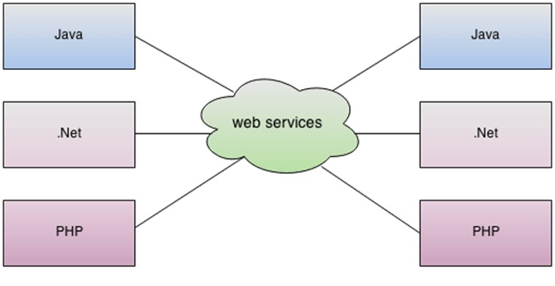
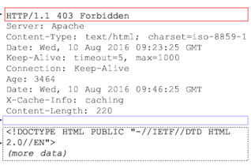
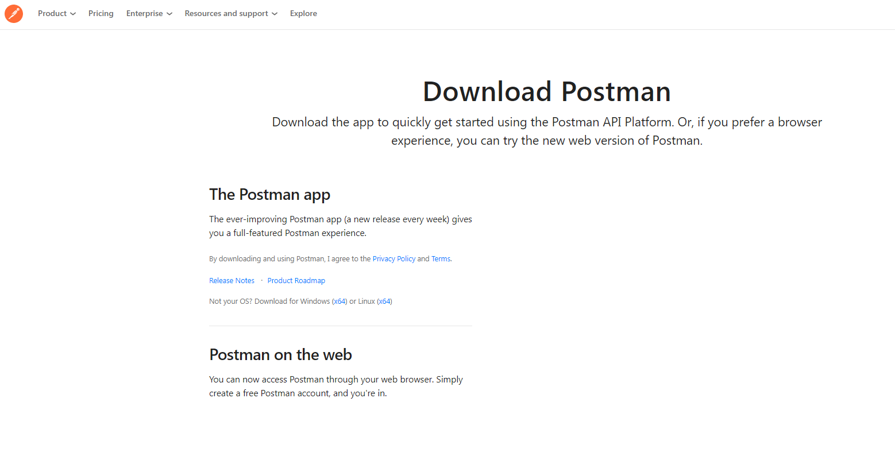
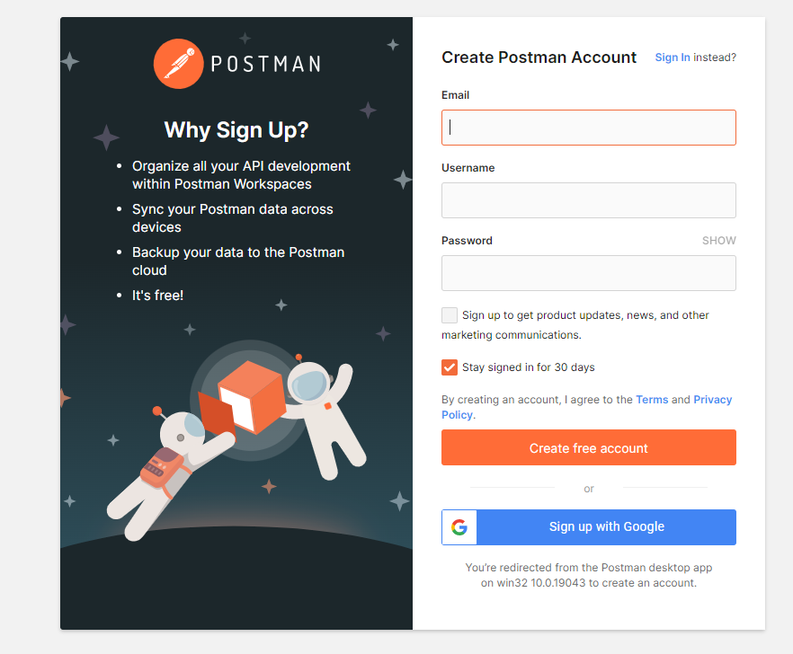
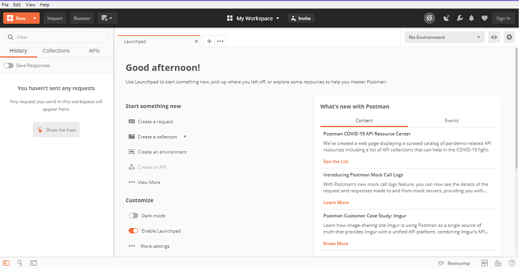

# Pengenalan Web Service
Web Service adalah sebuah aplikasi berbasis **client-server** atau **consumer-provider** yang dapat digunakan untuk menjembatani banyak aplikasi untuk saling **berkomunikasi** satu sama lain __tanpa dibatasi oleh bahasa pemrograman__ tertentu. Dalam Web Service, sebuah *teknologi web* seperti **HTTP** digunakan untuk mengirimkan file dengan format machine-readable seperti **XML** atau **JSON**.

Secara singkat, Web Service dapat didefinisikan sebagai berikut:
- Sebuah layanan yang tersedia melalui internet
- Merupakan aplikasi client-server atau komponen aplikasi untuk komunikasi.
- Client mengirimkan request ke server (service), dan service mengirimkan response ke client.
- Kumpulan standar atau protokol untuk bertukar informasi antara dua perangkat atau aplikasi.

https://www.cleo.com/blog/knowledge-base-web-services



Gambar diatas menunjukkan bagaimana aplikasi-aplikasi yang ditulis dengan berbagai bahasa dapat **saling berinteraksi** antar satu sama lain ataupun dengan Web Service itu sendiri. Interaksi ini dapat berupa permintaan data, mengirimkan notifikasi, atau mengeksekusi instruksi dari aplikasi tersebut.

# Jenis
https://www.studytonight.com/rest-web-service/types-of-webservices
## XML-RPC (Remote Procedure Call)
Protokol XML paling dasar untuk bertukar data antara berbagai perangkat di jaringan. XML-RPC menggunakan HTTP untuk dapat dengan cepat dan mudah berkomunikasi  dari klien ke server dan sebaliknya. Dalam XML-RPC interaksi ini dilakukan dengan mengirim **dokumen xml** yang didalamnya berisi **metode dan parameter dari permintaan yang diinginkan**.

Seperti namanya XML-RPC memanfaatkan komunikasi **RPC** (Remote Procedure Call) dimana satu komputer dapat membuat komputer lain mengeksekusi sebuah fungsi/subroutine seakan akan dilakukan oleh komputer lain tersebut. Berbeda dengan **IPC** (Inter-process communication) dimana sebuah proses berkomunikasi dengan process lain **didalam komputer/host machine yang sama**.

**Contoh Request XML-RPC**:
```xml
<?xml version="1.0"?>
<methodCall>
  <methodName>examples.getStateName</methodName>
  <params>
    <param>
        <value><i4>40</i4></value>
    </param>
  </params>
</methodCall>
```

Dapat dilihat dalam contoh request tersebut terdapat tag `<methodCall>` yang memberikan informasi bahwa didalam tag tersebut akan ada nama *method* yang ingin dipanggil dan *parameter* apa saja yang diberikan. Dalam tag `<methodName>` ada nama method yang ingin dipanggil. Method ini sendiri dapat berupa *fungsi/function* dalam pemrograman yang bertugas untuk melakukan intruksi-intruksi tertentu. Dalam tag `<params>` berisi *parameter* yang diberikan, parameter ini dapat dianggap seperti argumen dalam yang akan digunakan dalam *function* yang dipanggil pada `<methodName>`.

**Contoh Response XML-RPC**:
```xml
<?xml version="1.0"?>
<methodResponse>
  <params>
    <param>
        <value><string>South Dakota</string></value>
    </param>
  </params>
</methodResponse>
```

Ketika request dari client ini **berhasil diproses** oleh server, server akan mengirimkan kembali response dari request yang diberikan tadi sesuai dengan *method* dan *parameter* yang diberikan. Dalam contoh request tadi client mengirimkan request untuk meminta data **negara bagian** (state) dengan id `40` (dilihat dari parameter request), maka server memberikan response berupa string yang berisi `South Dakota`. Client akan menerima response yang dikirim oleh server ini.

**Contoh Fault/Error Response XML-RPC**:
```xml
<?xml version="1.0"?>
<methodResponse>
  <fault>
    <value>
      <struct>
        <member>
          <name>faultCode</name>
          <value><int>4</int></value>
        </member>
        <member>
          <name>faultString</name>
          <value><string>Too many parameters.</string></value>
        </member>
      </struct>
    </value>
  </fault>
</methodResponse>
```

Tentu saja akan ada kemungkinan client mengirimkan **request yang tidak sesuai**, kadang melakukan request pada data yang tidak tersedia, atau request yang dikirim tidak memiliki struktur yang benar. Server harus tetap dapat menangani request ini, proses ini disebut sebagai **Error Handling**, dalam kasus ini **client mengirimkan request dengan parameter berlebih** sehingga server tidak dapat memroses data tersebut. Server akan mengirimkan sebuah *Error Message* yang sesuai sehingga client dapat mengetahui error tersebut.

### Tag tipe data (data-type) dalam XML-RPC
- **Array**

```xml
<array>
  <data>
    <value><i4>1404</i4></value>
    <value><string>Something here</string></value>
    <value><i4>1</i4></value>
  </data>
</array>
```

> *Array of values*, tidak menyimpan `key`

- **Base64**
```xml
<base64>eW91IGNhbid0IHJlYWQgdGhpcyE=</base64>
```
> Data biner yang *di-encode* Base64

- **Boolean**
```xml
<boolean>1</boolean>
```
> Boolean logical value (0 atau 1)

- **Date/Time**
```xml
<dateTime.iso8601>19980717T14:08:55Z</dateTime.iso8601>
```
> Date and time in ISO 8601 format

- **Double**
```xml
<double>-12.53</double>
```
> Angka floating point presisi double

- **Integer**
```xml
<int>42</int>
```
> Atau

```xml
<i4>42</i4>
```
> Bilangan bulat, integer.

- **String**
```xml
<string>Hello world!</string>
```
> atau

```xml
Hello world!
```
> Rangkaian karakter. Harus mengikuti *encoding* XML.

- **Struct**
```xml
<struct>
  <member>
    <name>foo</name>
    <value><i4>1</i4></value>
  </member>
  <member>
    <name>bar</name>
    <value><i4>2</i4></value>
  </member>
</struct>
```
> Associative array

- **nil**
```xml
<nil/>
```

> Nilai nil; ekstensi XML-RPC

<br><br>


### SOAP (Simple Object Access Protocol)
Protokol layanan Web berbasis XML untuk bertukar data dan dokumen melalui HTTP atau SMTP (Simple Mail Transfer Protocol). Ini memungkinkan proses yang beroperasi pada sistem yang berbeda untuk berkomunikasi menggunakan XML.

### REST (Representational State Transfer)
Menyediakan komunikasi dan konektivitas antara perangkat dan internet berbasis API. Sebagian besar layanan RESTful menggunakan HTTP sebagai protokol pendukungnya. Penejelasan lebih lanjut mengenai REST akan **dibahas di bagian berikutnya**.

# Bagaimana Web Service Bekerja
Salah satu cara Web Service berinteraksi yaitu melalui protokol HTTP/HTTPS, Ada satu atau sekumpulan komputer yang bertindak sebagai client yang akan mengirimkan permintaan (request) kepada server dengan method-method (**HTTP Methods**) yang ada dan server akan mengirimkan data kembali (response) kepada client diikuti dengan kode status (**HTTP Status Code**).

## Alur Web Service

-> flow website (client adalah user)
  - client mengunjungi url tertentu di browser
  - browser mengirimkan request ke server dengan method `get`
  - server menerima request dan mengirimkan halaman yang diminta ke client
  - browser menerima response dari server
  - browser menampilkan (me-render) halaman yang diterima dari server
  - client melihat halaman yang sudah di-render

-> flow webservice (client dapat berupa user ataupun aplikasi lain)
  - client mengirimkan request ke server
  - server menerima request dan melakukan parsing request
  - server melakukan operasi yang diminta pada request
  - server mengirimkan response ke client
  - client menerima response dan melakukan parsing response

Dapat dilihat pada flow diatas sebenarnya alur dari proses Web Service mirip dengan alur proses Website, perbedannya hanya pada permintaan dalam website, ada peran browser untuk me-render halaman yang didapatkan.

## Struktur HTTP

Pada bentuk aslinya, sebuah HTTP Request atau bisa disebut juga HTTP Message berbentuk beberapa baris *plain-text* yang dikirimkan oleh client dan server. Oleh karena bentuknya yang hanya berupa plain-text, kita dapat mengirimkannya melalui tools command-line seperti [curl](https://en.wikipedia.org/wiki/CURL). Meskipun demikian, untuk mempermudah interaksi yang melibatkan HTTP Requests, biasanya kita menggunakan tools lain seperti [postman](https://getpostman.com), atau [insomnia](https://insomnia.rest/), tools-tools tersebut biasa disebut sebagai **HTTP Client**.

Meskipun pada akhirnya kita akan menggunakan tools atau bahasa pemrograman untuk berinteraksi melalui HTTP, ada baiknya kita memahami bagaimana sebuah HTTP Message itu dibentuk.


> `request` - permintaan dari *client* ke *server*, `response` - balasan dari *server* ke *client*

Dapat dilihat pada gambar di atas, pada `request` dan `response` dari HTTP terdapat struktur yang sama yaitu: `start-line`, `HTTP Headers`, `empty-line/baris kosong`, dan `body`.

### Start Line
Pada bagian start-line terdapat tiga bagian yaitu:
- **HTTP Method** (dibahas pada bagian selanjutnya), sebuah kata kerja seperti GET, PUT, POST, atau kata benda seperti HEAD, atau OPTIONS, yang mendeskripsikan action apa yang perlu dilakukan. Misal, GET menandakan bahwa sebuah *resource* harus diambil, atau POST memandakan bahwa sebuah *resource* harus ditambahkan ke server.
- **Request Target**, biasanya sebuah URL, path absolute, port, atau domain.
- **HTTP Version**, yang menandakan versi HTTP yang digunakan.

<div>
  
  <div align="center"><b>Contoh request HTTP</b></div>
</div>

<div>
  
  <div align="center"><b>Contoh response HTTP</b></div>
</div>

### Request Headers

Header HTTP memungkinkan client dan server menyampaikan informasi tambahan dari `request` atau `response` HTTP. Header terdiri dari nama case-insensitive diikuti oleh titik dua (:), kemudian dengan nilainya. Spasi sebelum nilai diabaikan.

> Jika kita melihat headers dengan prefix nama `X-`, berarti header tersebut merupakan header *custom* (vendor-specific), contoh `X-Archived-At`, `X-Forwarded-For`, dsb.


- **General Header**: Header HTTP yang dapat digunakan dalam `request` dan `response`, tidak berhubungan dengan konten/body yang dikirimkan.
- **Request Header**: Digunakan dalam `request` untuk memberikan informasi tentang konteks permintaan, sehingga server dapat menyesuaikan `response`.
> Misalnya, header `Accept-*` menunjukkan format respons yang diizinkan. Header lain dapat digunakan untuk memberikan kredensial atau authentication, atau untuk mendapatkan informasi tentang *user-agent* atau perujuk, dll.

- **Representation Header**: Header HTTP yang menjelaskan representasi spesifik dari `resource` yang dikirim pada `body` HTTP. Contoh dari representation header yaitu: `Content-Type`, `Content-Encoding`, `Content-Language`, dan `Content-Location`.

### Body

Bagian terakhir adalah `body`. Tidak semua `request`/`response` memilikinya: `request` yang mengambil `resource`, seperti `GET`, `HEAD`, `DELETE`, atau `OPTIONS`, biasanya tidak memerlukannya. Beberapa request yang mengirim data ke server untuk seperti `POST`.

Body biasanya dikirimkan dalam bentuk `plain-text` (json, xml, html), `binary`, atau `multipart`.



Body adalah bagian terakhir dari HTTP Message.


## HTTP Methods
Dalam protokol HTTP, ada berbagai **method** yang dapat digunakan untuk meminta data (request) ke server. Setiap **method** ini sudah memliki standarisasi kegunaanya, misalnya seperti `GET` untuk meminta data, dan `POST` untuk mengirimkan data. Tetapi, hal ini bukan menjadi aturan yang harus diikuti, dalam artian kita dapat mengirimkan data menggunakan `GET`, hal tadi hanyalah sebuah standar spesifikasi untuk menyamakan struktur dari Web Service atau API yang kita ingin buat.

Berikut adalah method-method yang ada dalam HTTP:

### GET
Metode HTTP GET digunakan untuk **membaca** (atau mengambil) *resource*.
Pada path yang benar, GET mengembalikan representasi data dalam XML atau JSON dan *response code* `HTTP 200 (OK)`.
Dalam path salah, GET umumnya mengembalikan `404 (Not Found)` atau `400 (Bad Request)`.

Menurut desain spesifikasi HTTP, permintaan GET (bersama dengan HEAD) hanya digunakan untuk membaca data dan tidak mengubahnya. Jangan mengekspos operasi yang tidak aman melalui GET seperti password dan data sensitif lainnya.

Contoh:  
GET http://www.example.com/customers/12345  
GET http://www.example.com/customers/12345/orders  
GET http://www.example.com/buckets/sample  

### HEAD
Metode HEAD meminta respons yang identik dengan permintaan GET, tetapi tanpa isi respons (response body).

### POST
Metode POST mengirimkan entitas ke *resource* yang ditentukan, sering kali menyebabkan perubahan status atau `side-effect` pada server.
Pada pembuatan yang berhasil, server akan mengirimkan status HTTP 201(Created), atau header Lokasi dengan link ke resource yang baru dibuat dengan status HTTP 201. Misal kita POST /user, maka dapat me-return /user/1, dimana user identifier `1` adalah user yang baru saja kita buat.

Contoh:  
POST http://www.example.com/customers  
POST http://www.example.com/customers/12345/orders  

### PUT
Metode PUT menggantikan semua representasi saat ini dari *resource* target dengan payload permintaan. PUT paling sering digunakan untuk melakukan **update**, mengirimkan PUT ke URI yang dikenal dengan `request body` yang berisi data resource asli yang sudah di modifikasi.

Misal data asli:
```json
{
  "id": 1,
  "name": "John Doe",
  "address": "Indonesia",
  "age": 30
}
```

Lakukan PUT ke `/user/1` dengan `request body`:
```json
{
  "id": 1,
  "name": "John Doe Aja",
  "address": "Bekasi",
  "age": 31
}
```
Akan mengganti user dengan id `1` dengan data baru yang dikirimkan.

Contoh:  
PUT http://www.example.com/customers/12345  
PUT http://www.example.com/customers/12345/orders/98765  
PUT http://www.example.com/buckets/secret_stuff  

### PATCH
Metode PATCH menerapkan modifikasi parsial pada *resource*. Permintaan PATCH hanya perlu berisi perubahan pada `resource`, bukan `resource` yang lengkap.

Misal data asli:
```json
{
  "id": 1,
  "name": "John Doe",
  "address": "Indonesia",
  "age": 30
}
```

Lakukan PUT ke `/user/1` dengan `request body`:
```json
{
  "name": "John Doe Aja",
  "age":  68
}
```
Akan **mengubah nama dan usia** user dengan id `1` dengan data baru yang dikirimkan, tanpa mengubah data lain yang tidak menjadi `request body`.

Contoh:  
PATCH http://www.example.com/customers/12345  
PATCH http://www.example.com/customers/12345/orders/98765  
PATCH http://www.example.com/buckets/secret_stuff  

### DELETE
Metode DELETE menghapus *resource* yang ditentukan.

Pada proses DELETE yang berhasil, server dapat mengirimkan status HTTP 200 (OK) dengan `response body` yang berisi data yang dihapus (tetapi sering dianggap membuang-buang bandwith), atau status HTTP 204 (No Content) tanpa `response body` untuk menandakan data telah berhasil dihapus.

Contoh:  
DELETE http://www.example.com/customers/12345  
DELETE http://www.example.com/customers/12345/orders  
DELETE http://www.example.com/bucket/sample  

### Dengan operasi CRUD
Berikut adalah tabel method yang paling umum digunakan beserta *use-case* dan response nya nya:
<table>
    <thead>
        <tr>
            <th rowspan=2>Method</th>
            <th rowspan=2>CRUD</th>
            <th colspan=2>Response</th>
        </tr>
        <tr>
          <th>Koleksi Data <br> <code>/siswa</code></th>
          <th>Data Spesifik <br> <code>/siswa/{id}</code></th>
        </tr>
    </thead>
    <tbody>
        <tr>
            <td>POST</td>
            <td>Create</td>
            <td>
              <code>201 (Created)</code>, 'Location' header with link to /customers/{id} containing new ID.
            </td>
            <td>
              <code>404 (Not Found)</code>, <code>409 (Conflict)</code> if resource already exists.
            </td>
        </tr>
        <tr>
            <td>GET</td>
            <td>Read</td>
            <td>
              <code>200 (OK)</code>, list of customers. Use pagination, sorting and filtering to navigate big lists.
            </td>
            <td>
              <code>200 (OK)</code> single customer.
              <code>404 (Not Found)</code> if ID not found or invalid.
            </td>
        </tr>
        <tr>
          <td>PUT</td>
          <td>Update/Replace</td>
          <td><code>405 (Method Not Allowed)</code>, unless you want to update/replace every resource in the entire collection.</td>
          <td>
          <code>200 (OK)</code> or <code>204 (No Content)</code>. <code>404 (Not Found)</code> if ID not found or invalid.
          </td>
        </tr>
        <tr>
          <td>PATCH</td>
          <td>Update/Modify</td>
          <td><code>405 (Method Not Allowed)</code>, unless you want to modify the collection itself.</td>
          <td><code>200 (OK) or 204 (No Content)</code>. <code>404 (Not Found)</code>, if ID not found or invalid.</td>
        </tr>
        <tr>
          <td>DELETE</td>
          <td>Delete</td>
          <td><code>405 (Method Not Allowed)</code>, unless you want to delete the whole collection—not often desirable.</td>
          <td><code>200 (OK)</code>. <code>404 (Not Found)</code>, if ID not found or invalid.</td>
        </tr>
    </tbody>
</table>


### Method Lain
Selain method diatas, ada beberapa method lain yang dapat digunakan seperti:  
**CONNECT**: Metode CONNECT membuat tunnel ke server yang diidentifikasi oleh *resource* target.  
**OPTIONS**: Metode OPTIONS menjelaskan opsi komunikasi untuk *resource* target.  
**TRACE**: Metode TRACE melakukan tes loop-back pesan di sepanjang jalur ke *resource* target.  

## HTTP Status Code
Pada setiap response yang dikirimkan oleh server, akan terdapat status code yang menunjukkan status dari proses request.
Semua status code respons HTTP dipisahkan menjadi **lima kelas atau kategori**. Digit pertama kode status mendefinisikan kelas respons, sedangkan dua digit terakhir tidak memiliki peran klasifikasi atau kategorisasi.

Ada lima kelas yang ditentukan oleh standar:
<details>
<summary><b>1xx informational response</b> – permintaan diterima, proses berlanjut</summary>

| Status code       | Meaning             |
| ---               | ---                 |
| 100               | Continue            |
| 101               | Switching protocols |
| 102               | Processing          |
| 103               | Early Hints         |
</details>

<details>
<summary><b>2xx successful</b> – permintaan berhasil diterima, dipahami, dan diterima</summary>

| Status code       | Meaning             |
| ---               | ---                 |
| 200           | OK                            |
| 201           | Created                       |
| 202           | Accepted                      |
| 203           | Non-Authoritative Information |
| 204           | No Content                    |
| 205           | Reset Content                 |
| 206           | Partial Content               |
| 207           | Multi-Status                  |
| 208           | Already Reported              |
| 226           | IM Used                       |
</details>

<details>
<summary><b>3xx redirection</b> – tindakan lebih lanjut perlu diambil untuk menyelesaikan permintaan</summary>

| Status code       | Meaning             |
| ---               | ---                 |
| 300               | Multiple Choices    |
| 301               | Moved Permanently   |
| 302             | Found (Previously "Moved Temporarily") |
| 303             | See Other                              |
| 304             | Not Modified                           |
| 305             | Use Proxy                              |
| 306             | Switch Proxy                           |
| 307             | Temporary Redirect                     |
| 308             | Permanent Redirect                     |
</details>

<details>
<summary><b>4xx client error</b> – permintaan mengandung sintaks yang buruk atau tidak dapat dipenuhi</summary>

| Status code       | Meaning             |
| ---               | ---                 |
| 400              | Bad Request                     |
| 401              | Unauthorized                    |
| 402              | Payment Required                |
| 403              | Forbidden                       |
| 404              | Not Found                       |
| 405              | Method Not Allowed              |
| 406              | Not Acceptable                  |
| 407              | Proxy Authentication Required   |
| 408              | Request Timeout                 |
| 409              | Conflict                        |
| 410              | Gone                            |
| 411              | Length Required                 |
| 412              | Precondition Failed             |
| 413              | Payload Too Large               |
| 414              | URI Too Long                    |
| 415              | Unsupported Media Type          |
| 416              | Range Not Satisfiable           |
| 417              | Expectation Failed              |
| 418              | I'm a Teapot                    |
| 421              | Misdirected Request             |
| 422              | Unprocessable Entity            |
| 423              | Locked                          |
| 424              | Failed Dependency               |
| 425              | Too Early                       |
| 426              | Upgrade Required                |
| 428              | Precondition Required           |
| 429              | Too Many Requests               |
| 431              | Request Header Fields Too Large |
| 451              | Unavailable For Legal Reasons   |
</details>

<details>
<summary><b>5xx server error</b> – server gagal memenuhi permintaan yang tampaknya valid</summary>

| Status code       | Meaning             |
| ---               | ---                 |
| 500              | Internal Server Error           |
| 501              | Not Implemented                 |
| 502              | Bad Gateway                     |
| 503              | Service Unavailable             |
| 504              | Gateway Timeout                 |
| 505              | HTTP Version Not Supported      |
| 506              | Variant Also Negotiates         |
| 507              | Insufficient Storage            |
| 508              | Loop Detected                   |
| 510              | Not Extended                    |
| 511              | Network Authentication Required |
</details>

Untuk informasi lebih detail dapat dilihat di [HTTP Status Code](https://en.wikipedia.org/wiki/List_of_HTTP_status_codes)

# Instalasi Postman
1.  <span class="c9">Install</span> <span class="c0">aplikasi native postman pada browser.</span>

<span style="overflow: hidden; display: inline-block; margin: 0.00px 0.00px; border: 0.00px solid #000000; transform: rotate(0.00rad) translateZ(0px); -webkit-transform: rotate(0.00rad) translateZ(0px); width: 601.70px; height: 309.33px;"></span>

<span style="overflow: hidden; display: inline-block; margin: 0.00px 0.00px; border: 0.00px solid #000000; transform: rotate(0.00rad) translateZ(0px); -webkit-transform: rotate(0.00rad) translateZ(0px); width: 601.70px; height: 342.67px;"></span>

<span class="c5 c6 c7"></span>

2.  <span class="c5">Setelah ter-</span><span class="c3">install</span><span class="c5">, anda dapat memilih untuk log-in menggunakan</span> <span class="c3">account</span><span class="c5">atau langsung menggunakan aplikasi tanpa membuat</span> <span class="c3 c6">account.</span>

<span style="overflow: hidden; display: inline-block; margin: 0.00px 0.00px; border: 0.00px solid #000000; transform: rotate(0.00rad) translateZ(0px); -webkit-transform: rotate(0.00rad) translateZ(0px); width: 601.70px; height: 372.00px;"></span>

<span class="c5 c6 c7"></span>

3.  <span class="c5">Buat akun dengan mengisi data-data yang diperlukan, atau</span> <span class="c3">log-in</span><span class="c5">menggunakan</span> <span class="c3">google account</span><span class="c5 c6 c7">.</span>

<span class="c5 c6 c7"></span>

<span class="c0"></span>

<span class="c0"></span>

<span style="overflow: hidden; display: inline-block; margin: 0.00px 0.00px; border: 0.00px solid #000000; transform: rotate(0.00rad) translateZ(0px); -webkit-transform: rotate(0.00rad) translateZ(0px); width: 601.70px; height: 496.00px;"></span>

<span class="c0"></span>

4.  <span class="c0">Anda telah berhasil masuk ke aplikasi postman dan dapat segera menggunakannya.</span>

<span style="overflow: hidden; display: inline-block; margin: 0.00px 0.00px; border: 0.00px solid #000000; transform: rotate(0.00rad) translateZ(0px); -webkit-transform: rotate(0.00rad) translateZ(0px); width: 601.70px; height: 320.00px;"></span>

<span class="c0"></span>


<!--
# Web Service Menggunakan python


# Menghubungkan dengan database (Web Service)

Salah satu fitur dari Web Service ini yaitu dapat ditulis dari berbagai bahasa pemrograman, bahkan sudah banyak framework yang dapat digunakan untuk membuat Web Service.

Pada contoh kali ini akan digunakan contoh REST API yang berisi list bahasa pemrograman dan ranking-nya dari GitHut, PYPL, dan TIOBE index. ([Sample Web Service](https://blog.logrocket.com/node-js-express-js-mysql-rest-api-example/))

Untuk mempermudah interaksi dengan REST API ini kita gunakan [Postman](https://www.getpostman.com/).

Berikut adalah data dalam database:


Kita dapat menguji koneksi dengan service dengan cara melakukan `GET` request ke endpoint `/programming-languages`. Server akan mengirimkan response berupa data dalam format `JSON`:


# Mengirimkan dan menerima data dari database

Selain dapat meminta data dari database, kita juga dapat mengirimkan data ke database. Data dikirimkan dalam format `JSON` umumnya menggunakan method `POST`.

Contoh membuat data baru dengan entry bahasa pemrograman `dart` beserta ranking-nya.


Server akan menerima data dari client dan menyimpannya di database dan mengirimkan response kembali:


Pada database data tersebut juga sudah tersimpan:


# Praktik Sederhana hasil Query upload data/download data otomatis

-->


# Sumber:
https://en.wikipedia.org/wiki/Remote_procedure_call
https://en.wikipedia.org/wiki/XML-RPC
https://www.dicoding.com/blog/apa-itu-web-service/
https://www.guru99.com/web-service-architecture.html
https://www.javatpoint.com/what-is-web-service
https://en.wikipedia.org/wiki/Web_service
https://www.cleo.com/blog/knowledge-base-web-services
https://www.mysqltutorial.org/mysql-sample-database.aspx
