# Mengolah Data dengan Python

## Konsep
### Pengertian Python
<br><br><br>
Python, salah satu bahasa pemrograman paling populer di dunia, telah menciptakan segalanya mulai dari algoritma rekomendasi Netflix hingga software yang mampu mengontrol mobil yang bisa mengemudi sendiri. Python adalah bahasa pemrograman yang dirancang untuk digunakan dalam berbagai aplikasi, termasuk ilmu data, pengembangan software dan website, otomatisasi, serta umumnya mampu menyelesaikan pekerjaan lainnya.

## Mengolah Nilai dengan OS Windows
### Install Python pada Windows
1. Download software python disini ([Download](https://www.python.org/downloads/))  sesuaikan dengan versi windows yang anda gunakan.
2. Double click pada software python yang telah didownload.<br><br><br><br>
3. Centang Install launcher for all user (recommended) dan Add Python 3.9 to PATH untuk penambahan path command Python, Lalu Jalankan proses Klik Install Now dan klik Yes bila ada notifikasi<br><br><br><br>
4. Proses Setup sedang berjalan, harap tunggu dan jangan sampai tekan close<br><br><br><br>
5. Proses Setup telah selesai, Click Close, Kita lanjut untuk test aplikasi dan test coding.<br><br><br><br>
6. Buka aplikasi python, Klik Windows => Semua aplikasi => Python 3.9 => Python 3.9 (64-bit).<br><br><br><br>
7. Kita akan menguji dengan perintah print (“Hello world”).<br><br><br><br>
8. Cara lain untuk menjalankan program python di windows adalah dengan mengetikkan command ```py namafile.py``` atau ```python namafile.py``` di command prompt, namun sebelum itu kita harus menyiapkan sebuah file, buatlah file hello.py sebagai berikut.<br><br><br><br>
9. Kemudian buka command prompt dan jalankan perintah ```py hello.py``` atau ```python namafile.py```<br><br>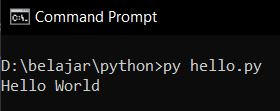<br><br>
10. Sebenarnya command ```py namafile.py``` atau ```python namafile.py``` mirip jika kita akan menjalankan program python pada linux, hanya saja di linux kita gunakan command ```python3 namafile.py```

### Install Library tambahan

Install library yang diperlukan dengan menjalankan command di bawah melalui command prompt (pip3 merupakan sebuah modul dari python 3 yang berfungsi untuk menginstall library tambahan)

1. ```pip3 install bounded-pool-executor``` : bounded-pool-executor merupakan sebuah library pada python yang memungkinkan kita untuk menjalankan proses secara parallel dengan memanfaatkan sumber daya yang ada pada komputer semaksimal mungkin.<br><br><br><br>
2. ```pip3 install mysql-connector-python``` : mysql-connector-python merupakan sebuah library pada python yang berfungsi untuk menghubungkan program dengan database (berkomunikasi).<br><br><br><br>
3. ```pip3 install pandas``` : pandas merupakan sebuah library pada python yang berfungsi untuk memanipulasi dan menganalisis data.<br><br><br><br>
4. ```pip3 install psutil``` : psutil merupakan sebuah library pada python yang berfungsi untuk mendeteksi jumlah core pada processor.<br><br>

### Program Python
Berikut adalah program python untuk mengolah nilai
```python
import mysql.connector as connection
import time
import pandas as pd
import psutil
from bounded_pool_executor import BoundedProcessPoolExecutor
import warnings

warnings.filterwarnings("ignore")


def loadDB(id_kota):
    t = time.time()
    try:
        mydb = connection.connect(host="localhost",
                                  database='CBT_JATIM',
                                  user="root",
                                  password="", use_pure=True)

        query = 'select id_siswa, nama, nrp, jawaban, jawaban_benar, id_mapel from soal_jawaban where id_kota=%d;' % id_kota
        ujian_siswa = pd.read_sql(query, mydb)

        mydb.close()  # close the connection
    except Exception as e:
        mydb.close()
        print(str(e))

    elapsed = time.time() - t
    print("Time Load DB  = {:.3f}".format(elapsed))
    ujian_siswa.loc[ujian_siswa['jawaban'] == ujian_siswa['jawaban_benar'], ['score']] = 1
    ujian_siswa = ujian_siswa.fillna(0)
    result = ujian_siswa.groupby(['id_siswa', 'nama', 'nrp', 'id_mapel'])['score'].agg('sum')
    result.to_csv("id_kota_%d.csv" % id_kota)


if __name__ == '__main__':

    tAll = time.time()
    n_jobs = psutil.cpu_count()
    print("Ready to worker")
    cnt = 0
    with BoundedProcessPoolExecutor(max_workers=n_jobs) as worker:
        for id_kota in range(1,5):
            print('#%d Worker initialization %s' % (cnt, id_kota))
            cnt += 1
            print("Load DB %d, please wait ..." % id_kota)
            worker.submit(loadDB, id_kota)
    elapsed = time.time() - tAll
    print("Time selesai  = {:.3f}".format(elapsed))
```
Penjelasan :
1. ```import mysql.connector as connection``` : digunakan untuk mengimport library mysql-connector-python yang berfungsi untuk menghubungkan program dengan database, sedangkan ```as connection``` digunakan untuk menyingkat nama library sehingga dalam program library ini cukup dipanggil dengan nama connection tidak perlu dengan mysql.connector
2. ```import time``` : digunakan untuk mengimport library time yang berfungsi untuk menghitung lama waktu yang diperlukan oleh program untuk tereksekusi
3. ```import pandas as pd``` : digunakan untuk mengimport library pandas yang berfungsi untuk manipulasi dan analisis data yang pada kasus ini dipergunakan untuk melakukan penilaian dan menulis hasil penilaian ke csv, sedangkan ```as pd``` berarti pada program untuk memanggil library ini cukup dengan variabel pd
4. ```import psutil``` : digunakan untuk mengimport library psutil yang nantinya berfungsi untuk melakukan deteksi jumlah core pada processor
5. ```from bounded_pool_executor import BoundedProcessPoolExecutor``` : digunakan untuk mengimport modul BoundedProcessPoolExecutor dari library bounded_pool_executor yang berfungsi untuk menjalankan proses secara parallel pada semua core yang ada
6. ```import warnings``` : digunakan untuk menampilkan error yang terjadi, dikarenakan terkadang apabila ada error python akan langsung melakukan terminate tanpa menampilkan pesan error
7. ```warnings.filterwarnings("ignore")``` : digunakan untuk melakukan ignoring pada semua warning yang muncul
8. ```def loadDB(id_kota):``` : fungsi loadDB, dimana fungsi ini akan menerima parameter id_kota
9. ```t = time.time()``` : berfungsi sebagai pencatat waktu awal, ketika program memasuki fungsi loadDB()
10. ```try:``` dan ```except Exception as e:``` : pertama program akan mencoba untuk menjalankan code yang berada pada block try, namun jika ada error maka akan dilempar ke dalam code yang berada pada block except
11. ```mydb = connection.connect(host="Localhost", database='(db name)', user="(username)", password="(password)", use_pure=True)``` : berfungsi untuk menghubungkan program ke mysql server dengan database, username, dan password yang tersedia
12. ```query = 'select id_siswa, nama, nrp, jawaban, jawaban_benar, id_mapel from soal_jawaban where id_kota=%d;' % id_kota``` : merupakan query yang akan kita jalankan pada database, untuk ```%d``` dan ```%id_kota``` berarti query ini akan mengikuti berapa id_kota yang dimasukkan sebagai parameter pada fungsi loadDB()
13. ```ujian_siswa = pd.read_sql(query, mydb)``` : berfungsi untuk menjalankan query pada database, menggunakan library pandas, dan hasilnya disimpan ke dalam variabel ujian_siswa
14. ```mydb.close()``` : menutup koneksi ke database
15. ```except Exception as e:``` : apabila terdapat error pada block try maka program akan masuk ke sini
16. ```print(str(e))``` : menampilkan pesan error
17. ```elapsed = time.time() - t``` : menghitung waktu yang dibutuhkan untuk load data dari database dengan cara mengurangi waktu saat ini dengan waktu yang ada di variabel t
18. ```print("Time Load DB  = {:.3f}".format(elapsed))``` : Menampilkan waktu yang diperlukan untuk melakukan load database
19. ```ujian_siswa.loc[ujian_siswa['jawaban'] == ujian_siswa['jawaban_benar'], ['score']] = 1``` : apabila ```ujian_siswa['jawaban']``` yang merupakan jawaban dari siswa sama dengan ```ujian_siswa['jawaban_benar']``` yang merupakan kunci jawaban, maka nilai ```score``` dijadikan 1
20. ```ujian_siswa = ujian_siswa.fillna(0)``` : fungsi ini bertujuan untuk mengubah field yang null menjadi angka 0, adanya field yang null ini akibat jawaban dari siswa salah
21. ``` result = ujian_siswa.groupby(['id_siswa', 'nama', 'nrp', 'id_mapel'])['score'].agg('sum')``` : bertujuan untuk melakukan grouping (setelah penilaian selesai maka jumlah skor dari siswa akan ditambahkan dan pada akhirnya akan mendapatkan nilai dari siswa tersebut)
22. ```result.to_csv("id_kota_%d.csv" % id_kota)``` : berfungsi untuk mencetak hasil ke dalam file csv dengan nama file sesuai id kota yang sedang di query
23. ```if __name__ == '__main__':``` : deklarasi fungsi main
24. ```tAll = time.time()``` : berfungsi untuk mencatat waktu awal program berjalan
25. ```n_jobs = psutil.cpu_count()``` : mendefinisikan jumlah job yang dapat berjalan pada satu waktu tertentu, bergantung pada jumlah core yang ada pada perangkat
26. ```cnt = 0``` : Variabel counter jumlah worker
27. ```with BoundedProcessPoolExecutor(max_workers=n_jobs) as worker:``` : Memanggil fungsi BoundedProcessPoolExecutor dengan jumlah pekerja sesuai jumlah core processor dan memberikan alias worker
28. ```for id_kota in range(x,y):``` : untuk id_kota pada rentang x hingga y lakukan perulangan (ketika run program x dan y silakan diganti dengan id_kota misal ```range(1,5)```)
29. ```worker.submit(loadDB, id_kota)``` : memanggil fungsi loadDB dan mengirimkan id_kota dengan menggunakan BoundedProcessPoolExecutor
30. ```elapsed = time.time() - tAll``` : untuk menghitung waktu yang diperlukan dalam menjalankan program
31. ```print("Time selesai  = {:.3f}".format(elapsed))``` : print waktu yang diperlukan untuk menjalankan program

### Menjalankan program
1. Sebelum menjalankan program kita perlu membuat view pada database terlebih dahulu, tujuannya agar kita tidak perlu melakukan inner join berkali-kali, dan kita dapat melakukan select secara langsung terhadap tabel yang sudah di join
```sql
CREATE VIEW soal_jawaban AS SELECT jawaban.id_siswa, siswa.nama, siswa.nrp, siswa.id_kota, jawaban.jawaban, soal.jawaban_benar, jawaban.id_mapel FROM jawaban INNER JOIN soal ON jawaban.id_soal = soal.id INNER JOIN siswa ON jawaban.id_siswa = siswa.id;
```
2. Maka kita akan mendapati sebuah views bernama soal_jawaban<br><br>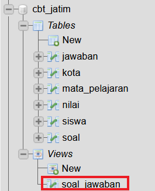<br><br><br>
3. Jika sudah maka kita dapat menjalankan programnya dengan command (di cmd) ```python <<namafile>>.py```<br><br><br><br>
4. Maka kita akan mendapatkan file csv yang berisi nilai dari kota yang kita proses<br><br><br><br><br>

## Mengolah Nilai dengan Raspberry

### Instalasi VnC
Apabila melakukan koneksi melalui SSH hanya diberikan tampilan terminal, apabila menggunakan VnC bisa mendapatkan tampilan GUI. yang perlu dilakukan adalah

1. Download VnC Viewer di sini ([Download](https://www.realvnc.com/en/connect/download/viewer/))
2. Buka file yang telah di download<br><br><br><br>
3. Klik OK, kemudian next<br><br><br><br>
4. Kemudian kita akan dibawa ke halaman End-User License Agreement, centang I Accept untuk melanjutkan instalasi, seperti gambar dibawah ini :<br><br><br><br>
5. Klik Next, dan kita akan menuju tahap terakhir instalasi dimana kita diminta apakah anda ingin menambahkan shortcut pada dekstop atau tidak, jika tidak anda bisa klik next, seperti gambar dibawah ini :<br><br><br><br>
6. Instalasi selesai, kemudian buka program VNC Viewer<br><br>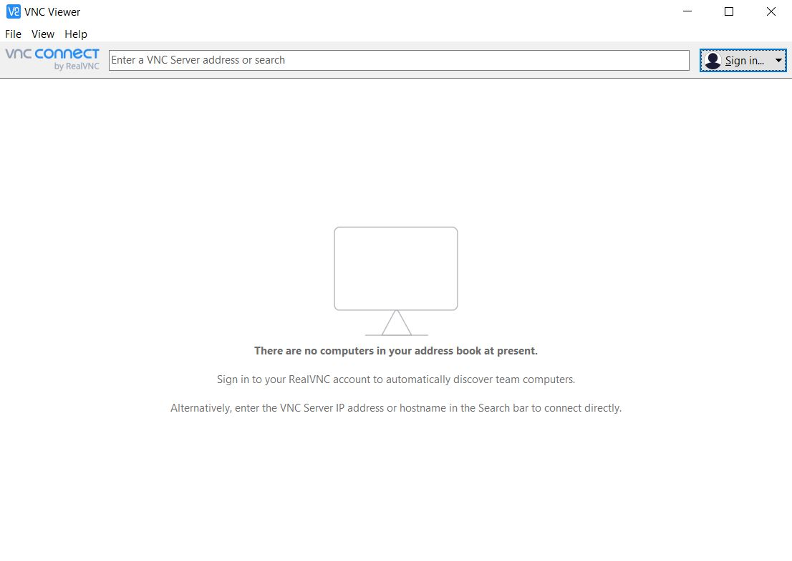<br><br>
7. Login menggunakan username ```klasterdti@gmail.com``` dengan Password ```klasterdti1959```<br><br><br><br>
9. Lakukan koneksi ke salah satu Node<br><br><br><br>
10. Atau jika node tidak muncul, kalian bisa ketikkan alamat IP pada bagian atas VNC Viewer<br><br><br><br> 

### Koneksi VPN
Dikarenakan Raspberry yang berada di lab KCKS yang menggunakan jaringan dari ITS, maka untuk melakukan koneksi SSH diperlukan VPN dan juga one-time-password yang bisa didapatkan dari website my.its.ac.id **(jika langsung melakukan praktikum di laboratorium, maka tidak perlu melakukan hal berikut, cukup sambungkan internet anda dengan internet laboratorium)**

1. Masuk dan Login ke my.its.ac.id
2. Masuk ke bagian One-time-password<br><br><br><br>
3. Pilih Tambah Akses VPN<br><br><br><br>
4. Download Konfigurasi OpenVPN (my.its.ac.id)<br><br><br><br>
5. Download OpenVPN di sini ([Download](https://openvpn.net/community-downloads/))
6. Import konfigurasi OpenVPN <br><br><br><br>
7. Maka VPN siap digunakan <br><br><br><br>

### Install MariaDB
Karena kita akan menggunakan SQL maka kira harus menginstall MariaDB terlebih dahulu, dan berikut adalah caranya :

1. Mulai dari titik ini hingga selanjutnya, disarankan untuk mengakses raspberry sebagai root dengan command ```sudo -i```
2. ```apt-get update``` : digunakan untuk mengupdate package pada raspberry<br><br>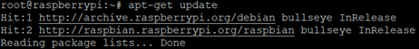<br><br>
3. ```apt-get install mariadb-server``` : digunakan untuk menginstall mariadb<br><br><br><br>
4. ```mysql_secure_installation``` : digunakan untuk melakukan konfigurasi instalasi mysql<br><br><br><br>
5. ```mariadb --version``` : digunakan untuk memeriksa apakah mariadb sudah terinstall<br><br>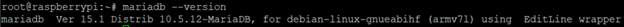<br><br>
6. ```cd /var/lib/mysql``` : untuk masuk ke folder di mana mysql diinstall<br><br><br><br>
7. ```ls``` : melakukan listing file apa saja yang ada dalam folder<br><br>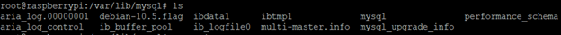<br><br>
8. ```rm -r *``` : hapus semua file dalam folder (karena kita akan melakukan install ulang)<br><br><br><br>
9. ```mysql_install_db --user=mysql --basedir=/usr --datadir=/var/lib/mysql``` : untuk menginstall ulang mysql (jika tidak diinstall ulang biasanya akan ada masalah, yaitu database ter-reset sendiri)<br><br><br><br>
10. ```systemctl restart mysqld``` : melakukan restart terhadap service mysqld<br><br><br><br>
11. ```systemctl restart mysql.service``` : melakukan restart terhadap service mysql.service<br><br><br><br>
12. ```systemctl restart mariadb``` : melakukan restart terhadap service mariadb<br><br><br><br>
13. ```mysql -uroot``` : masuk ke service mysql dengan username root<br><br>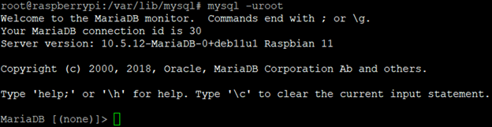<br><br>
14. ```CREATE USER '<<username>>'@'localhost' IDENTIFIED BY '<<password>>';``` : membuat user baru yang melakukan listen ke localhost<br><br>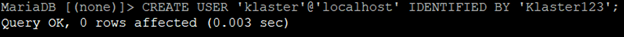<br><br>
15. ```GRANT ALL ON *.* TO '<<username>>'@'localhost';``` : Memberikan semua privilege ke user baru<br><br><br><br>
16. ```FLUSH PRIVILEGES;``` : reload grant table
17. ```quit;``` : keluar dari service mysql

### Install Python
Untuk menjalankan program script yang diberikan oleh Bapak Dwi, diperlukan python maka dilakukan installasi python

1. ```apt-get update``` : digunakan untuk mengupdate package pada raspberry<br><br><br><br>
2. ```apt-get install python3.9 python3-pip``` : digunakan untuk menginstall python 3.9 dan pip 3
3. ```python --version```  : untuk memeriksa versi python, jika berjalan maka python berhasil diinstall<br><br>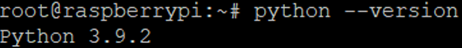<br><br>
4. ```pip --version``` : untuk memeriksa versi pip, jika berjalan maka pip berhasil diinstall<br><br>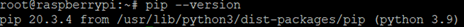<br><br>

### Install Library tambahan

Install library yang diperlukan dengan command :

1. ```pip3 install bounded-pool-executor``` : bounded-pool-executor merupakan sebuah library pada python yang memungkinkan kita untuk menjalankan proses secara parallel dengan memanfaatkan sumber daya yang ada pada komputer semaksimal mungkin.<br><br><br><br>
2. ```pip3 install mysql-connector-python``` : mysql-connector-python merupakan sebuah library pada python yang berfungsi untuk menghubungkan program dengan database (berkomunikasi).<br><br>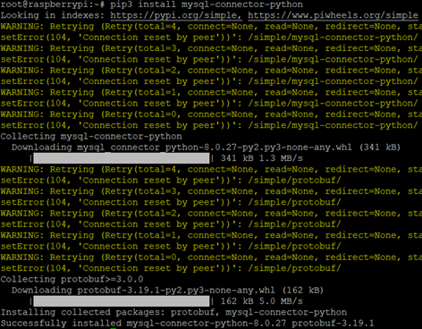<br><br>
3. ```pip3 install pandas``` : pandas merupakan sebuah library pada python yang berfungsi untuk memanipulasi dan menganalisis data.<br><br><br><br><br>
4. ```pip3 install psutil``` : psutil merupakan sebuah library pada python yang berfungsi untuk mendeteksi jumlah core pada processor.<br><br>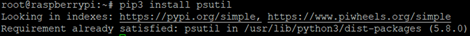<br><br>

### Download Database

1. Download database dari dropbox dengan command sebagai berikut<br><br>```wget https://www.dropbox.com/s/fb3gdwk12b0t69h/cbtjatimsm-cluster2022.tar.gz?dl=0 -O cbtjatimsm-cluster2022.tar.gz```<br><br>
2. ```tar -xvf cbtjatimsm-cluster2022.tar.gz``` : untuk melakukan extract terhadap file tar.gz yang baru di download<br><br>
3. ```apt install parallel  ``` atau ```wget -O - pi.dk/3 || curl pi.dk/3/ ```: Menginstall GNU Parallel untuk mengimport database<br><br>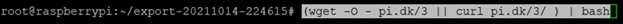<br>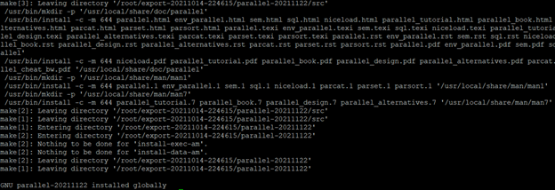<br>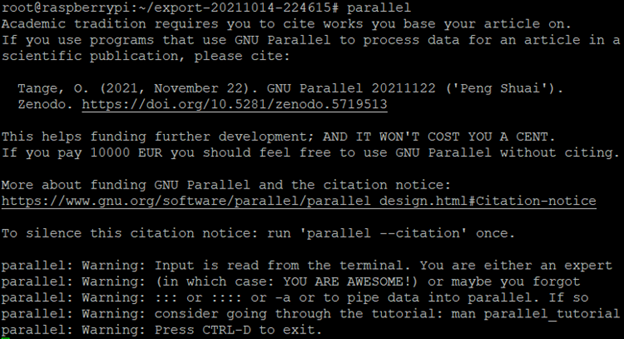<br><br>
4. ```mysql -u root``` : masuk ke dalam mysql server
5. ```CREATE DATABASE CBT_JATIM; ``` : membuat database bernama CBT_JATIM
6. ```cd schema``` : masuk ke folder schema
7. ```ls -A1 *.sql | parallel --joblog joblog.txt mysql -uroot CBT_JATIM "<"``` : mengimport schema ke dalam database CBT_JATIM<br><br><br><br>
8. Untuk tabel-tabel lain ulangi langkah nomor 6 dan 7, namun cd ke folder terkait, misal :
```
cd Jawaban
ls -A1 *.sql | parallel --joblog joblog.txt mysql -uroot - CBT_JATIM "<"
``` 
<br><br><br><br><br>

### Menjalankan Program Python
Jika sudah berhasil melakukan semua langkah, terakhir jalankan program berikut ([program pengolahan nilai](#program-python)) dengan command ```python3 <<namaprogram>>.py``` **JANGAN LUPA BUAT VIEW DI DATABASE**<br><br>```CREATE VIEW soal_jawaban AS SELECT Jawaban.id_siswa, Siswa.nama, Siswa.nrp, Siswa.id_kota, Jawaban.jawaban, Soal.jawaban_benar, Jawaban.id_mapel FROM Jawaban INNER JOIN Soal ON Jawaban.id_soal = Soal.id INNER JOIN Siswa ON Jawaban.id_siswa = Siswa.id;```<br><br>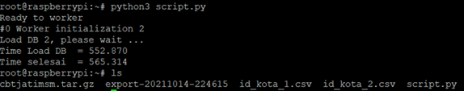<br>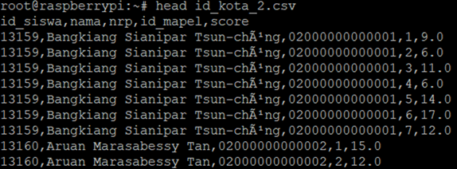<br><br>

Jika ada error `ValueError: numpy.ndarray Size Changed ..` silahkan mendownload package libatlas-base-dev dengan menjalankan: 
```
sudo apt install libatlas-base-dev
sudo pip install numpy
```

## Referensi
https://www.wartaekonomi.co.id/read366664/apa-itu-bahasa-pemrograman-python<br>
https://pimylifeup.com/raspberry-pi-mysql/<br>
https://realpython.com/installing-python/<br>
https://www.itnotbad.com/cara-install-python-3-9-di-windows-10-untuk-belajar-programing/<br>
https://www.dicloud.id/tutorial/articles/panduan-cara-memakai-vnc-viewer-di-windows-android<br>
